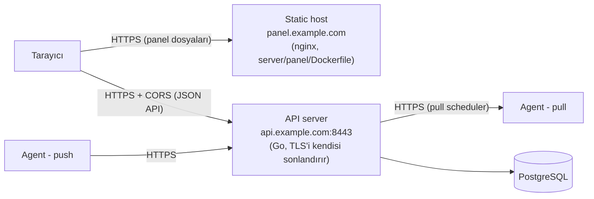

# HealthBeat — Dağıtım (Deployment)

Bu doküman üretim kurulumunu anlatır: API server'ı, panelin ayrı bir static host'ta
servis edilmesi ve TLS. Geliştirme ortamı için `PROGRESS.md`'ye bak.

## 1. Topoloji



- **Panel** (`server/panel/`) yalnızca statik dosyalardır; iş mantığı ve veri server'dadır.
- **Panel ve API farklı origin'lerdedir** (`panel.example.com` ↔ `api.example.com`), bu
  yüzden server'da **CORS izin listesi** tanımlamak zorunludur (bölüm 4).
- **Server düz HTTP dinlemez**: `ListenAndServeTLS` ile TLS'i kendisi sonlandırır
  (PROMPT bölüm 5: HTTPS zorunlu). İleride Docker'a alındığında da sertifika dosyaları
  container'a mount edilir ya da önüne, arka tarafa yeniden TLS ile bağlanan bir proxy konur.

## 2. Server yapılandırması (ortam değişkenleri)

| Değişken | Zorunlu | Açıklama |
| --- | --- | --- |
| `DATABASE_URL` | evet | PostgreSQL bağlantı adresi. Üretimde `sslmode=require` (ya da `verify-full`) kullan. |
| `TLS_CERT_FILE`, `TLS_KEY_FILE` | evet | PEM sertifika zinciri ve özel anahtar. Değişiklikler yeniden başlatmadan algılanır (bölüm 3). |
| `JWT_ACCESS_SECRET`, `JWT_REFRESH_SECRET` | evet | Her biri **en az 32 bayt** ve birbirinden **farklı** olmalı (`openssl rand -base64 48`); aksi halde server başlamaz. |
| `BOOTSTRAP_ADMIN_EMAIL`, `BOOTSTRAP_ADMIN_PASSWORD` | ilk kurulumda | **İlk super_admin'i** oluşturur — yalnızca hiç super_admin yokken, yani her açılışta güvenle bırakılabilir; ilk açılıştan sonra ortamdan **kaldır**. İkisi birlikte verilmeli; şifre en az 12 karakter. Hesap **ilk girişte yeni bir şifre belirlemek zorundadır**. Hiç super_admin yoksa ve bunlar da verilmemişse server açılır ama log'a `level=WARN msg="no super_admin exists …"` yazar (kimse panele giremez). |
| `SECRETS_ENCRYPTION_KEY` | evet | `pull_secret`'ları şifreler. `openssl rand -base64 32`. **Yedekle** — kaybolursa saklı pull secret'lar çözülemez (etkilenen agent'ların credential'ı yenilenir). |
| `CORS_ALLOWED_ORIGINS` | panel ayrı origin'deyse | Virgülle ayrılmış tam origin listesi, örn. `https://panel.example.com`. `*`, path ve sondaki `/` **reddedilir** (server başlamaz). Boşsa hiç CORS başlığı gönderilmez. |
| `TRUSTED_PROXIES` | proxy arkasındaysa | Server'ın `X-Forwarded-For` başlığına güvendiği reverse proxy'ler: virgülle ayrılmış IP, CIDR ya da **host adı** (host adları 30 sn'de bir, çözülemedikleri sürece 2 sn'de bir ve tanınmayan bir eşten `X-Forwarded-For`'lu istek gelince hemen yeniden çözülür; docker'da container IP'si değişebilir). İstemci IP'si (hız sınırları, denetim kaydı) yalnızca istek bunlardan birinden geldiğinde başlıktan okunur; aksi halde TCP eşidir. Docker Compose varsayılanı `panel`; bare-metal'de boş (başlık hiç okunmaz). `0.0.0.0/0` ve geçersiz girdiler **reddedilir** (server başlamaz). Bkz. "Hız sınırları ve istemci IP'si". |
| `METRICS_RETENTION_DAYS` | hayır | Metrik örneklerinin saklanma süresi (gün); varsayılan `30`, `0` = sonsuza kadar sakla. Eski örnekler saatlik bir işle silinir. |
| `LATEST_AGENT_VERSION`, `MIN_SUPPORTED_AGENT_VERSION` | hayır | Panelin agent'ları "güncel / güncelleme var / desteklenmiyor" diye sınıflandırdığı sürüm politikası (SemVer, örn. `1.2.0`). Varsayılan: latest = bu server derlemesinin bildiği en güncel **agent** sürümü (server'ın kendi sürümü değil; bkz. `docs/DISTRIBUTION.md`, iki sürüm hattı), min = boş (hiçbiri "desteklenmiyor" olmaz). **Yalnızca bilgilendirir**, hiçbir agent reddedilmez. Bkz. `docs/COMPATIBILITY.md`. |
| `AUTO_MIGRATE` | hayır | Açılışta bekleyen veritabanı migration'larını uygula (varsayılan `true`). `false` ise uygulamaz, şema geriyse açılmaz. Bkz. "Veritabanı migration'ları". |
| `PULL_CA_CERT_FILE` | hayır | Pull agent sertifikalarını doğrulayacak CA (PEM). Verilmezse doğrulama kapalıdır. Bkz. "Özel (kurum içi) CA". |
| `HTTP_ADDR` | hayır | Varsayılan `:8443`. |
| `ACCESS_TOKEN_TTL`, `REFRESH_TOKEN_TTL` | hayır | Varsayılan `15m` / `168h`. |
| `RATE_LIMIT_AUTH_FAILURES_PER_MINUTE` | hayır | IP başına başarısız login/agent-auth bütçesi, varsayılan `10`, `0` = kapalı. |
| `RATE_LIMIT_INGEST_PER_MINUTE` | hayır | Doğrulanmış push agent başına, varsayılan `120`, `0` = kapalı. |
| `LOG_LEVEL` | hayır | `debug`, `info` (varsayılan), `warn`, `error`. Başarılı agent raporları ve `/healthz` yalnızca `debug`'da loglanır. Bkz. "Loglama". |
| `LOG_FORMAT` | hayır | `text` (varsayılan, `key=value`) ya da `json` (log toplayıcılar için). |
| `LOG_ERROR_BODY_BYTES` | hayır | Hata alan (4xx/5xx) isteklerde loga yazılan istek/yanıt gövdesinin azami boyutu, varsayılan `4096`, `0` = gövde yazılmaz, en fazla `1048576`. Hassas alanlar her zaman maskelenir. |
| `SMTP_HOST`, `SMTP_PORT`, `SMTP_USERNAME`, `SMTP_PASSWORD`, `SMTP_FROM` | hayır | Alert e-postaları. `SMTP_HOST` boşsa yalnızca log'a yazılır (e-posta **gitmez**). **Port 465 = implicit TLS**; diğer portlarda (587 vb.) sunucu STARTTLS sunuyorsa kullanılır. Kullanıcı adı/şifre yalnızca TLS üzerinden (ya da localhost'a) gönderilir. |
| `PANEL_BASE_URL` | şifre sıfırlama için | Panelin kullanıcıya görünen adresi (`scheme://host[:port]`, yol ve sondaki `/` yok), örn. `https://panel.example.com`. **"Şifremi unuttum" e-postalarındaki bağlantının kökü** olur; isteğin `Host` başlığından türetilmez (başlık enjeksiyonuyla bağlantının saldırgan bir alan adına yöneltilmesini önler). Geçersizse server başlamaz; boşsa e-posta ile şifre sıfırlama kapalıdır. |

### E-posta ile şifre sıfırlama

Giriş sayfasındaki **Şifremi unuttum** bağlantısı çalışsın diye `SMTP_HOST` **ve** `PANEL_BASE_URL` ayarlı olmalı;
biri eksikse özellik kapalıdır (giriş sayfası bunu kullanıcıya açıkça söyler, server başlangıçta nedenini log'lar).

Akış: kullanıcı e-postasını girer → server **tek kullanımlık, 30 dakika geçerli** bir bağlantı e-postalar
(`<PANEL_BASE_URL>/reset-password#token=…`) → bağlantıda yeni şifre seçilir → tüm açık oturumlar kapanır ve
kullanıcıya "şifreniz değiştirildi" e-postası gider. Denetim kaydına `auth.password_reset_requested` ve `auth.password_reset` yazılır.

Güvenlik: yanıt hesabın var olup olmadığını sızdırmaz (her geçerli biçimli e-postaya aynı `204`); ham token veritabanında
**saklanmaz** (yalnızca SHA-256 özeti); kullanıcı başına yalnızca **son** bağlantı geçerlidir; token adresin `#` parçasında
taşınır (server günlüklerine/`Referer`'a girmez); istekler IP başına ve e-posta başına sınırlıdır (posta bombası önlemi);
kullanılmış/süresi dolmuş kayıtlar saatlik işle temizlenir. Kullanıcı yalnızca kendi e-posta kutusuna erişimiyle sıfırlayabilir:
**e-posta hesabı ele geçirilirse şifre de ele geçirilir**, bu yüzden yönetici hesaplarında güvenilir bir kutu kullan.

Denemek için gerçek SMTP gerekmez: `docker compose --profile mail up -d` bir **Mailpit** yakalayıcısı başlatır
(e-postalar iletilmez, `http://localhost:8025` gelen kutusunda görünür). `.env`'ye `SMTP_HOST=mailpit`, `SMTP_PORT=1025`,
`SMTP_FROM=healthbeat@localhost`, `PANEL_BASE_URL=https://localhost` ekleyip `docker compose up -d server` ile server'ı yeniden başlat.

**Alert e-postaları arka planda gönderilir:** metrik alma (push/pull) yolunu bloklamazlar. SMTP
oturumu en fazla 30 sn sürer; kuyruk (256) dolarsa yeni bildirimler düşürülür ve log'a yazılır
(alert yine de veritabanında ve panelde görünür). Sunucu kapanırken kuyruk 10 sn'ye kadar
boşaltılır. **Zaman aşımları:** API sunucusu okuma tarafında sıkıdır (header 10 sn, gövde 30 sn),
boşta kalan bağlantıları 120 sn sonra kapatır.

### Loglama

Server logu stderr'e yazar (Docker'da `docker compose logs server`); her satırın seviyesi (`level=`) vardır. Biçim
`LOG_FORMAT` ile `text` (`key=value`) ya da `json` seçilir.

- **İstek kimliği:** her isteğe bir `X-Request-ID` verilir (istekte geçerli bir tane gelirse — ör. önündeki reverse proxy'den —
  o korunur) ve yanıt başlığında döner. O isteğin bütün log satırları `request_id=` taşır; bir kullanıcının aldığı hatayı
  logda bulmak için yanıttaki kimliği ara. İstek satırlarında ayrıca `user_id` (panel kullanıcısı), `host_id` (agent) ve
  `ip` bulunur.
- **İstek satırları:** `5xx` → `ERROR`, `4xx` → `WARN`, diğerleri `INFO`; başarılı agent raporları (`POST /api/v1/metrics`)
  ve `/healthz` yalnızca `LOG_LEVEL=debug`'da görünür (150+ agent ~30 sn'de bir rapor verir).
- **Hata ayrıntısı:** hata alan isteklerde veriyle ilgili sorunlar yeniden üretmeden incelenebilsin diye `query`, izin
  listesindeki başlıklar (`req_headers`: Content-Type, User-Agent, agent sürümü vb.), istek gövdesi (`req_body`) ve
  hata yanıtı (`resp_body`) de yazılır; en fazla `LOG_ERROR_BODY_BYTES` bayt (kesilirse `req_body_truncated=true`).
  Adında `password`, `token`, `secret` geçen alanlar `[REDACTED]` olur; `Authorization` ve `Cookie` başlıkları hiç
  yazılmaz. Gövdeler e-posta adresi gibi kişisel veri içerebilir: log erişimini buna göre sınırla ya da
  `LOG_ERROR_BODY_BYTES=0` ile kapat.
- **Beklenmeyen hata (panic):** istek `500` ve `request_id`'li bir JSON yanıtla biter, log'a yığın iziyle
  `msg="panic recovered"` yazılır; server çalışmaya devam eder. Arka plan işleri (pull scheduler, offline izleyici,
  retention vb.) panic'lerse loglanıp birkaç saniye sonra yeniden başlatılır.

### Hız sınırları ve istemci IP'si

Rate limiter süreç içidir: birden fazla server kopyası çalıştırırsan her biri kendi sayacını tutar.

Başarısız giriş/yenileme ve şifre sıfırlama sınırları **istemci IP'si** başına sayılır; denetim kaydı da bu IP'yi yazar.
İstemci IP'si normalde TCP eşidir. Server bir reverse proxy'nin arkasındaysa eş proxy'nin kendisidir — Docker Compose'da
panel `/api/`'yi server'a proxy'lediği için bütün panel kullanıcıları tek IP (panel container'ı) görünürdü ve tek bir
kişinin hatalı girişleri herkesi kilitlerdi. Bu yüzden `TRUSTED_PROXIES`'teki proxy'lerden gelen isteklerde istemci IP'si
`X-Forwarded-For`'dan okunur: başlık **sağdan sola** okunur ve güvenilir proxy olmayan ilk adres alınır. Başlığa başka
hiç kimseden güvenilmez — aksi halde server'a doğrudan bağlanan biri her istekte başka bir sahte IP yazarak sınırları
atlatırdı. Push agent'lar server'a doğrudan bağlandığı için onlar için her zaman TCP eşi kullanılır.

Compose'da varsayılan `TRUSTED_PROXIES=panel`'dir (docker adı; panel server'dan sonra açıldığı için açılışta çözülemez,
2 sn'de bir yeniden denenir; container yeniden oluşup IP'si değişirse yeni adresten gelen ilk istek yeniden çözümü tetikler.
Ad çözülene kadar panelden gelen istekler panelin IP'siyle sayılır — güvenli taraf). Docker ağının tamamına
güvenilmez, çünkü host'tan (ve bazı kurulumlarda dışarıdan) gelen bağlantılar ağ geçidi adresiyle görünebilir. Server'ın
önüne kendi reverse proxy'ni koyarsan (yük dengeleyici vb.) onun adresini ekle ve proxy'nin `X-Forwarded-For`'u **ezdiğinden
ya da sonuna eklediğinden** emin ol (panelin nginx'i `$remote_addr` ile ezer). Açılışta log, hangi proxy'lere güvenildiğini
(`client IPs: …`) ve host adlarının çözüldüğü adresleri (`trusted proxy "panel" resolved to …`) yazar.

### Veritabanı

- **PostgreSQL ≥ 15 gerekir** (şema `UNIQUE NULLS NOT DISTINCT` ve `ON DELETE SET NULL (sütun)` kullanır).
  Şemanın tamamı: [docs/VERITABANI.md](VERITABANI.md).
- Metrik uç noktası (`GET /hosts/:id/metrics`) aralıktaki her ham örneği olduğu gibi döner — hiçbir kovalama/ortalama
  yapmaz; çok geniş aralıklı/çok örnekli istekler yanıtı büyütür (panel bunu yalnızca geçmiş grafiğinde kullanır). Anlık
  durum için `GET /hosts/:id/metrics/latest` yalnızca en son ham örneği döner (hiç yoksa `204`). Docker container'ları için yalnızca **son durum**
  saklanır (geçmiş tutulmaz).
- Kullanıcı e-postaları küçük harfe normalize edilir (veritabanı kısıtı da bunu zorlar).

### Veritabanı migration'ları

Migration dosyaları `server/migrations/` altındadır (`NNNNNN_ad.up.sql` / `.down.sql`) ve **server
binary'sine gömülüdür** — ayrıca dosya dağıtmana gerek yok. **Server açılırken bekleyen migration'ları
kendisi uygular** (`AUTO_MIGRATE`, varsayılan `true`).

- Her migration **kendi işleminde** çalışır; geçmiş kaydıyla birlikte commit olur. Bir hata olursa o
  migration'dan **hiçbir şey kalmaz** ve server açılmaz; dosyayı düzeltip yeniden başlatmak yeterli.
- **Birden çok kopya aynı anda açılabilir:** PostgreSQL advisory lock'u sayesinde her migration tam bir kez
  çalışır (birden çok server'ın aynı anda açıldığı denemede her migration tek bir server tarafından uygulanır).
- Geçmiş `healthbeat_migrations` tablosundadır (sürüm, ad, **checksum**, zaman).
- **Uygulanmış bir migration'ı asla düzenleme** — server checksum uyuşmazlığında açılmaz. Değişiklik için
  yeni, bir sonraki numaralı bir dosya ekle. Uygulanmış en yüksek sürümden **küçük** numaralı bekleyen
  bir migration da (dal birleştirme hatası) ve veritabanı, binary'nin bilmediği migration'lara sahipse
  (yani **eski bir sürümü yeni bir şemada** çalıştırmak) da reddedilir.
- `AUTO_MIGRATE=false` ile server hiçbir şey uygulamaz ama **şema geride ise açılmayı reddeder**;
  o zaman migration'ları kendin uygula.

Komutlar (yalnızca `DATABASE_URL` gerekir; `.env` de okunur):

```sh
healthbeat-server migrate status         # her migration: applied <zaman> / pending
healthbeat-server migrate up             # bekleyenleri uygula
healthbeat-server migrate baseline <N>   # elle kurulmuş bir veritabanını benimse (aşağıya bak)
```

**Elle kurulmuş bir veritabanını benimseme (nadiren gerekir):** tabloları olan ama migration geçmişi olmayan bir
veritabanı **asla boş sanılmaz** (`CREATE TABLE`'ları canlı veri üstünde yeniden çalıştırmak felaket olurdu); server ve
`migrate up` açık bir hata verip durur. Şemanın hangi sürümde olduğunu belirledikten sonra
`healthbeat-server migrate baseline <N>` o sürüme kadarkileri "uygulanmış" diye **kaydeder, hiçbirini çalıştırmaz**. Yanlış sürüm
verirsen server olmayan bir şemayı var sanır: önce kontrol et (ör. yeni bir veritabanına tüm migration'ları uygulayıp
`pg_dump --schema-only` çıktısını karşılaştır).

**Geri alma otomatik değildir.** `.down.sql` dosyaları elle (`psql -f`) çalıştırılır ve ardından geçmişten
o sürümün satırı silinmelidir (`DELETE FROM healthbeat_migrations WHERE version = N`).

**İlk yönetici:** migration'lar hiçbir hesap eklemez. İlk açılışta `BOOTSTRAP_ADMIN_EMAIL` /
`BOOTSTRAP_ADMIN_PASSWORD` ile ilk süper admini oluştur; panele bu şifreyle girince **yeni bir şifre belirlemen istenir**
ve önceki oturumlar kapanır. İlk girişten sonra bu iki değişkeni silebilirsin.

Şifre politikası her yerde aynı: **en az 12 karakter, en çok 72 bayt** (bcrypt sınırı).

## 3. TLS

### Geliştirme
Kendinden imzalı sertifika: `openssl req -x509 -newkey rsa:2048 -nodes -keyout key.pem -out cert.pem -days 365 -subj "/CN=localhost"`.
Agent'larda `insecure_skip_verify: true` gerekir.

### Üretim (Let's Encrypt)

```sh
# API'nin alan adı için (80. porta erişim gerekir; yoksa DNS-01 kullan)
certbot certonly --standalone -d api.example.com
```

```sh
TLS_CERT_FILE=/etc/letsencrypt/live/api.example.com/fullchain.pem
TLS_KEY_FILE=/etc/letsencrypt/live/api.example.com/privkey.pem
```

- Server bu dosyaları **başlangıçta doğrular** (bozuksa açılmaz) ve sonrasında yaklaşık
  **dakikada bir** değişiklik olup olmadığına bakar. certbot yenilediğinde (~60 günde bir)
  yeni sertifika **yeniden başlatma olmadan** kullanılmaya başlar. Yeni dosyalar bozuksa
  eskisi sunulmaya devam eder ve log'a yazılır (`tls: certificate files changed but cannot be loaded`).
- `privkey.pem` varsayılan olarak yalnızca root tarafından okunabilir. Server'ı root
  olmayan bir kullanıcıyla çalıştırıyorsan, bir certbot `--deploy-hook`'u ile dosyaları
  server kullanıcısının okuyabileceği bir dizine kopyala ve `TLS_*_FILE`'ı oraya yönlendir.
- Halka açık bir CA sertifikasıyla agent'lar sertifikayı **normal şekilde
  doğrular**: `insecure_skip_verify` alanını `false` bırak (sistem kök sertifikaları
  kullanılır).

### Özel (kurum içi) CA

Sertifikalarını kendi CA'n imzalıyorsa, doğrulamayı kapatmana gerek yok:

- **Push agent → server:** agent yapılandırmasında `ca_cert_file` (PEM). Verildiğinde **yalnızca o CA**
  güvenilir (`curl --cacert` gibi; sistem kökleri değil) ve sertifikanın **adresi de doğrulanır** — server
  sertifikası, agent'ın `server_url`'deki host'u için geçerli olmalı (DNS ya da IP SAN). Kurulum script'iyle:
  `install.sh install --mode push … --ca-cert /yol/ca.crt` (CA'yı `/etc/healthbeat/ca.pem`'e koyar).
  `ca_cert_file`, `insecure_skip_verify` ile birlikte verilemez (çelişkili); pull modunda anlamsızdır.
- **Server → pull agent:** server'da `PULL_CA_CERT_FILE` (PEM). Verildiğinde scheduler her poll'da agent'ın
  sertifikasını bu CA'ya karşı doğrular. **Agent'lar IP ile poll edildiği için** her agent sertifikası, o
  agent'ın IP adresini **IP SAN** olarak içermelidir (`subjectAltName=IP:10.0.0.5`); süresi dolmuş, başka CA'dan
  gelen ya da başka bir IP için düzenlenmiş sertifikalar reddedilir ve **paylaşılan secret o agent'a
  gönderilmez**. Agent sertifikasını kurulumda `--tls-cert/--tls-key` ile ver.
- Dosyalar açılışta doğrulanır: yol yanlışsa ya da dosyada PEM sertifika yoksa server/agent **açılmaz**
  (yazım hatası doğrulamayı sessizce kapatmasın diye).
- `PULL_CA_CERT_FILE` verilmezse pull agent sertifikaları **doğrulanmaz** (bu geriye dönük uyumlu varsayılan;
  kendinden imzalı pull kurulumları çalışmaya devam eder). Bu durumda kimlik doğrulama paylaşılan secret +
  agent tarafındaki IP izin listesiyle yapılır ve server açılışta bunu log'a yazar.

Örnek (openssl ile bir agent sertifikası):

```sh
openssl req -new -newkey ec -pkeyopt ec_paramgen_curve:prime256v1 -nodes -subj /CN=agent-10.0.0.5 \
        -keyout agent.key -out agent.csr
openssl x509 -req -in agent.csr -CA ca.crt -CAkey ca.key -CAcreateserial -days 365 -out agent.crt \
        -extfile <(printf 'subjectAltName=IP:10.0.0.5\nextendedKeyUsage=serverAuth\n')
```

### Bilinen TLS sınırlamaları
- **Pull doğrulaması opt-in:** `PULL_CA_CERT_FILE` yoksa scheduler agent sertifikalarını doğrulamaz (yukarıya bak).
- **CA rotasyonu/CRL/OCSP yok:** iptal edilmiş sertifikalar için sertifika iptal listesi denetlenmez; CA'yı
  değiştirmek dosyayı güncelleyip server/agent'ı yeniden başlatmayı gerektirir.
- mTLS yok (PROMPT: v2+).

## 4. Panel — ayrı static host

Panel bir SPA'dır (`server/panel/`, React + Vite). Build çıktısı (`server/panel/dist`) her yerde servis
edilebilir; tek gereksinim **SPA fallback**'idir (bilinmeyen yolların `index.html`'e
düşmesi — `/alerts` gibi istemci tarafı (SPA) route'lar için).

### Yapılandırma: API adresi çalışma zamanında

API adresi bundle'a gömülmez; `config.js` dosyasından okunur (`server/panel/public/config.js`):

```js
window.HEALTHBEAT_CONFIG = { apiBaseUrl: 'https://api.example.com' }
```

Böylece **aynı build her ortamda** kullanılır. `apiBaseUrl` boşsa istekler aynı origin'e
gider (Vite dev proxy'si böyle çalışır).

### Docker ile

Panel kendi TLS'ini kendi sonlandırır — `/certs/cert.pem` + `/certs/key.pem` okur, tıpkı server gibi
(bölüm 3, "Gerçek sertifika kullanmak"). Compose kullanıyorsan bu, server'la **aynı** `certs`
volume'üdür (bölüm 6); panel'i tek başına çalıştırıyorsan kendi sertifika çiftini mount et:

```sh
cd server/panel
docker build -t healthbeat-panel .
docker run -p 443:8443 -v /yol/certs:/certs:ro -e API_BASE_URL=https://api.example.com healthbeat-panel
```

Container açılışta `API_BASE_URL`'i **doğrular** (yalnızca `https://host[:port]` /
`http://host[:port]`; path, tırnak, boşluk `;` reddedilir ve container başlamaz), sonra
`config.js`'i yazar ve aynı değeri CSP başlığına koyar. nginx yapılandırması
`server/panel/deploy/nginx.conf.template` içindedir:

- SPA fallback, `/assets/` için 1 yıl cache (dosya adları içerik hash'li), `index.html` ve
  `config.js` için cache yok.
- Güvenlik başlıkları: **CSP** (`script-src 'self'`; `connect-src` yalnızca kendisi + API),
  `X-Frame-Options: DENY`, `nosniff`, `Referrer-Policy`, HSTS. Panel token'larını
  `localStorage`'da tuttuğu için (bilinen v1 trade-off'u) script enjeksiyonuna karşı asıl
  savunma bu CSP'dir.
- Container yalnızca **HTTPS (8443, dışarıya istediğin porttan yayınlarsın)** dinler; düz HTTP hiç
  sunulmaz. `/certs`'te sertifika yoksa nginx açılmayı reddeder — bilerek: yarım bir yapılandırmayla
  sessizce HTTP'ye düşmek yerine.
- `/certs/cert.pem`+`key.pem` değişince (yıllık rotasyon gibi) nginx bunu **kendiliğinden algılamaz**
  (server'ın Go tarafındaki hot-reload'unun aksine); container'ı yeniden başlat.

### Docker'sız
`npm ci && npm run build`, ardından `dist/` içeriğini kendi TLS'ini sonlandıran bir static
host'a koy, `config.js`'i elle düzenle ve SPA fallback'i aç (nginx: `try_files $uri /index.html;`).
CSP'yi kendi host'unda da uygulamanı öneririz (`deploy/nginx.conf.template`'e bak).

### Server tarafı: CORS
Panelin origin'ini server'a bildir:

```sh
CORS_ALLOWED_ORIGINS=https://panel.example.com
```

Yalnızca listedeki origin'lere CORS başlıkları verilir (izin verilen istekler: `GET, POST,
PUT, DELETE`; başlıklar: `Authorization, Content-Type`). Kimlik doğrulama `Authorization`
başlığıyla yapıldığı için `Allow-Credentials` kullanılmaz. Push/pull agent'lar tarayıcı
olmadığından CORS'tan etkilenmez.

## 5. Üretim kontrol listesi

- [ ] `JWT_*_SECRET`, `SECRETS_ENCRYPTION_KEY` rastgele üretildi ve **güvenli yerde yedeklendi**
- [ ] İlk süper admin `BOOTSTRAP_ADMIN_*` ile oluşturuldu, şifresi ilk girişte değiştirildi ve `BOOTSTRAP_ADMIN_*` ortamdan kaldırıldı
- [ ] `DATABASE_URL` TLS kullanıyor, veritabanı yedekleniyor (migration'lardan önce de yedek al: bir migration veri dönüştürebilir)
- [ ] Birden çok kopya ve otomatik migration kullanılacaksa `AUTO_MIGRATE` kararı verildi (ör. üretimde `false` + dağıtım adımında `migrate up`)
- [ ] API için CA imzalı sertifika + otomatik yenileme (certbot) kurulu
- [ ] `CORS_ALLOWED_ORIGINS` yalnızca panel origin'ini içeriyor
- [ ] Server bir proxy arkasındaysa `TRUSTED_PROXIES` yalnızca o proxy'yi içeriyor; iki farklı istemciden giriş yapılıp
      denetim kaydında (`/audit`) iki farklı IP görüldü
- [ ] Panel gerçek bir sertifika sunuyor (kendinden imzalı değil) — bkz. "Gerçek sertifika kullanmak"
- [ ] `SMTP_*` ayarlandı ve bir test alert'iyle e-postanın gittiği görüldü
- [ ] "Şifremi unuttum" isteniyorsa `PANEL_BASE_URL` da ayarlandı ve bir hesapla sıfırlama e-postası uçtan uca denendi
- [ ] Agent'lar `insecure_skip_verify: false` ile bağlanıyor (özel CA kullanıyorsan `ca_cert_file` ile)
- [ ] Pull agent kullanılıyorsa `PULL_CA_CERT_FILE` kararı verildi (agent sertifikalarında IP SAN'ı unutma)

## 6. Docker Compose (tek komutla kurulum)

> **Sürüm etiketli imajlar:** yayınlanmış bir sürümü kullanmak için `.env`'ye `HB_REGISTRY=ghcr.io/<sahip>` ve
> `HB_VERSION=X.Y.Z` ekle, `docker compose pull && docker compose up -d` çalıştır (yerelde derlemek için ikisini de boş
> bırak). Güncelleme ve geri alma adımları (veritabanı yedeği dahil): [docs/DISTRIBUTION.md](DISTRIBUTION.md#8-server-dağıtımı).

Yukarıdaki bölümler server ve panel'i ayrı ayrı, elle dağıtmayı anlatır. Tek makinede hızlı
kurulum (ya da küçük bir üretim) için proje kökündeki `docker-compose.yml`, PostgreSQL + API
server + panel'i tek komutla ayağa kaldırır:

```sh
./deploy/init-env.sh        # .env üretir (rastgele sırlar); yalnızca bir kez
docker compose up -d --build
```

- **Panel:** `https://localhost` (`HB_PANEL_PORT`, varsayılan `443`) · **API:** `https://localhost:8443` (`HB_API_PORT`, agent'lar buraya bağlanır). İkisi de aynı kendinden imzalı sertifikayı sunar (aşağıdaki "Gerçek sertifika kullanmak"); tarayıcı ilk seferde bir güven uyarısı gösterir.
- `init-env.sh` var olan bir `.env`'e **dokunmaz** — sırları yeniden üretmek istersen dosyayı
  sil ve yeniden çalıştır (bu, saklı pull secret'ları ve mevcut oturumları geçersiz kılar).
- Çıktıdaki geçici admin şifresi yalnızca o an gösterilir (`.env`'de `BOOTSTRAP_ADMIN_PASSWORD`
  olarak da durur); ilk girişte yeni şifre belirlemen istenir.

**Servisler:**

| Servis | Ne yapar |
| --- | --- |
| `db` | PostgreSQL 16, `pgdata` volume'ünde. |
| `certs-init` | Tek seferlik: `certs` volume'ünde sertifika yoksa kendinden imzalı bir çift yazar, sonra çıkar. Sertifika **varsa dokunmaz**. |
| `server` | API server; `db` sağlıklı ve `certs-init` tamamlanınca başlar. |
| `panel` | Panel; kendi TLS'ini `certs` volume'ünden (server'la aynı sertifika) sonlandırır. `API_PROXY_URL=https://server:8443` ile panel `/api/` isteklerini server'a **kendi origin'inden** proxy'ler (CORS ve sertifika onayı gerekmez — bkz. `server/panel/deploy/docker-entrypoint.d/15-healthbeat-config.sh`). Panel ile API'yi ayrı alan adlarında sunacaksan `.env`'de `API_PROXY_URL=` (boş) yap, `API_BASE_URL` ve `CORS_ALLOWED_ORIGINS` ver (bölüm 4). |

**Kalıcı veriler** adlandırılmış volume'lerdedir; `docker compose down` / `up` onları **silmez**:
`pgdata` (tüm kullanıcılar, sunucular, metrikler, alert'ler) ve `certs` (server VE panelin okuduğu TLS
sertifikası — ikisi de aynı domain'i sunduğu için tek çift yeter). Volume'leri silmek yalnızca
`docker compose down -v` ile olur.

**Panel her zaman HTTPS'tir**, kendinden imzalı ya da gerçek bir sertifikayla — hiçbir zaman düz HTTP
sunmaz, bu yüzden `HB_PANEL_BIND` varsayılanı `0.0.0.0`'dır. Gerçek sertifikan yoksa tarayıcı kendinden
imzalı olana bir kez güven uyarısı gösterir; bağlantı yine de uçtan uca şifrelidir.

**Gerçek sertifika kullanmak** (önerilir — nereden geldiği bu projenin ilgi alanı dışında: satın alınmış,
müşterinin verdiği, bir CA'ya imzalattığın, fark etmez) için `certs-init` ilk çalışmadan önce (ya da
volume'ü temizleyip yeniden) `cert.pem` + `key.pem`'i `certs` volume'üne koy — dosya varsa `certs-init`
dokunmaz, **server ve panel aynı çifti okur.** Sunucunun/panelin hangi domain(ler) için geçerli olacağını
kendinden imzalı sertifika için `HB_TLS_HOSTS`'a yaz (yalnızca **ilk** oluşturmada okunur, virgülle ayrılmış
DNS/IP; tarayıcının VE agent'ların bağlanacağı gerçek domain'i buraya ekle, ör.
`HB_TLS_HOSTS=healthbeat.xxx.com`). Yenilemede aynı iki dosyayı değiştirirsin; server bunu kendiliğinden
algılar, panel (nginx) container'ının yeniden başlatılması gerekir.

**Yedekleme:** `docker compose exec db pg_dump -U healthbeat healthbeat > backup.sql` (veya
volume'ü doğrudan yedekle). `.env`'deki `JWT_*`, `SECRETS_ENCRYPTION_KEY`, `POSTGRES_PASSWORD`'ü
de ayrıca güvenli bir yerde tut.

**Güncelleme:** `git pull && docker compose up -d --build` — server açılışta bekleyen
migration'ları kendisi uygular (`AUTO_MIGRATE`, bölüm 2).

**Log'lar:** `docker compose logs -f server` (ya da `panel`, `db`). Seviye, biçim ve hata ayrıntısı: bölüm 2, "Loglama".
