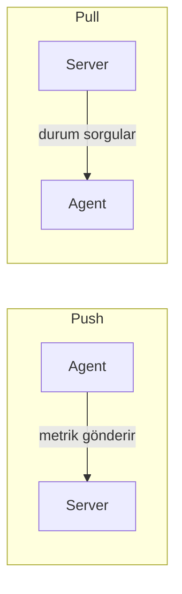
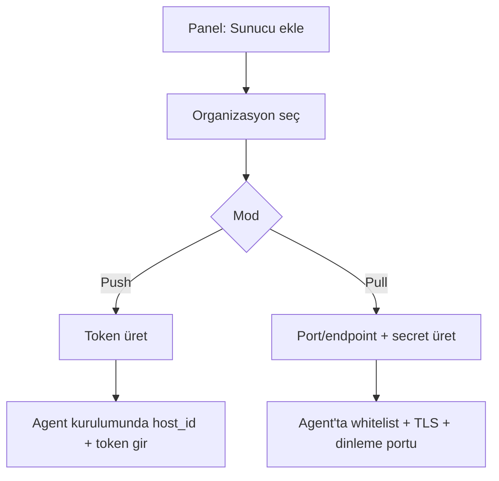

# HealthBeat — Mimari ve tasarım kararları

Bu belge sistemin **ne yaptığını ve neden öyle yaptığını** anlatır; kod yorumları buradaki bölüm numaralarına atıf yapar
("bkz. docs/MIMARI.md bölüm 5"). Kurulum ve işletim için `docs/DEPLOYMENT.md`, `docs/AGENT.md`, `docs/DISTRIBUTION.md`;
sürümler arası uyum için `docs/COMPATIBILITY.md`; veritabanı için `docs/VERITABANI.md`.

---

## 1. Proje özeti

HealthBeat, sunuculardaki **CPU, RAM, disk kullanımı** ve **Docker container durumlarını** izleyen, eşik aşımında
**alert (e-posta)** üreten bir agent–server monitoring sistemidir.

Temel prensip: **Tüm karar mekanizması (eşik kontrolü, alert üretimi, bildirim) server tarafında çalışır.** Agent yalnızca
veri toplar ve iletir/döner; hiçbir karar mantığı taşımaz.

Kapsam: monitoring + alert + dashboard/panel. Sonraki adımlar bölüm 10'da.

---

## 2. Mimari ve teknoloji yığını

### Bileşenler

- **Server** (`server/`): merkezi izleme, karar mekanizması, veri deposu, API.
- **Panel** (`server/panel/`): web arayüzü (React SPA); server'la aynı sürüm hattında yayınlanır.
- **Agent** (`agent/`): izlenen makineye kurulan küçük Go binary'si; metrik toplar, push ya da pull modunda çalışır.

Terimler: **host** = izlenen makine (panelde "sunucu"); **agent** = o makinede çalışan program.

### Teknoloji kararları

| Katman | Teknoloji |
| --- | --- |
| Agent | Go (yalnızca stdlib) |
| Server | Go |
| Panel | React, TypeScript, Vite |
| Veritabanı | PostgreSQL ≥ 15 |
| İletişim | REST/HTTPS |
| Bildirim | SMTP (e-posta); veritabanı SMS/Slack/Discord/Telegram için hazır, uygulama yok |

PostgreSQL: ilişkisel veriler (organizasyon, sunucu, eşik, alert, kullanıcı/rol) ile zaman serisi metrik verisi tek
veritabanında tutulur. Metrik hacmi çok büyürse aynı PostgreSQL üzerine **TimescaleDB** eklenebilir; bu yüzden `metrics`
tablosu doğal anahtar `(host_id, recorded_at)` ile zamana göre partition'a açık tasarlanmıştır.

### Çalışma modları (sunucu bazında seçilir, oluşturulurken)

| Mod | Trafik yönü | Açıklama |
| --- | --- | --- |
| **Push** (agent → server) | İçeriden dışarı | Agent, belirlenen aralıkla metrikleri server'a gönderir. Yalnızca çıkış izni yeter. |
| **Pull** (server → agent) | Dışarıdan içeri | Server, belirlenen aralıkta agent'a bağlanıp durumu sorgular; agent'ta yerel bir HTTPS API'si dinler. |

Bir server aynı anda push ve pull sunucuları yönetebilir; mod, sunucu eklenirken seçilir ve sonradan değişmez.



---

## 3. Veri modeli

Tam şema, ilişkiler ve kısıtlar: **`docs/VERITABANI.md`** (tek kaynak). Öne çıkan kararlar:

- **Organizasyonlar bir ağaçtır** (üst şirket → alt şirketler). Sunucu bir organizasyona bağlıdır.
- **Sunucu üç tabloya yayılır:** `hosts` (kimlik/bağlantı), `host_status` (anlık durum), `host_inventory` (yavaş değişen
  envanter). Panelde görünen ad `hosts.title`; makinenin kendi hostname'i envanterde.
- **Eşikler:** `threshold_defaults` (genel ya da organizasyon) + `host_custom_thresholds` (sunucuya özel; mount/container
  başına olabilir). Çözümleme sırası bölüm 8'de.
- **Yetkiler veritabanındadır:** `roles`, `permissions`, `role_permissions`. Kod `if role == "admin"` demez; yetki
  denetimi her zaman `permission_key` üzerindendir (`internal/rbac`). İleride özel roller eklemek yeni satırdır.
- **Bildirim kuralları** (`notification_routes`) ve **iletişim kişileri** (`organization_contacts`) bölüm 8'de anlatılır.
- Kullanıcı tablosunda ileride iki faktörlü doğrulama için `two_factor_enabled` / `two_factor_channel` alanları hazırdır;
  şimdilik yalnızca saklanır.

---

## 4. Roller ve yetkilendirme (RBAC)

| Rol | Kapsam |
| --- | --- |
| **Süper Admin** | Tüm organizasyonlar ve sunucular üzerinde tam yetki (kullanıcı yönetimi, organizasyon ağacı, genel eşikler dahil) |
| **Organizasyon Admin** | Atandığı organizasyon(lar)ı **ve altındaki tüm dalı** yönetir; üst zincirini yalnızca adıyla görür, kardeş dalları göremez |
| **Operatör** | Yalnızca kendisine atanan sunucuları görür (tek tek ya da "organizasyondaki tüm sunucular" ile toplu atanır); alert'leri onaylayabilir |

Kurallar:

- **Atama aşağıya miras kalır.** Bir yöneticiyi alt şirkete atamak yalnızca o dalı verir; üst şirkete atamak tüm dalı verir.
- **Üst zincir bağlam olarak görünür:** organizasyon listesinde `access: "context"` ile, yalnızca ad ve konum; adres,
  sunucular, kişiler, eşikler ve kurallar (kendi dalının dışındakiler) kapalıdır.
- **Organizasyon ağacını yalnızca süper admin değiştirir** (oluşturma, taşıma, silme).
- Bir sunucu oluşturulurken organizasyon seçimi zorunludur (bkz. bölüm 6).

---

## 5. Server auth ve panel güvenliği

### Panel (kullanıcı) auth

- E-posta + şifre; şifreler bcrypt ile hash'lenir; en az 12 karakter, en çok 72 bayt.
- Kısa ömürlü access token + döndürülen refresh token (aile bazlı iptal; yeniden kullanım tüm aileyi kapatır).
- Yönetici tarafından oluşturulan hesap ilk girişte şifresini değiştirmek zorundadır.
- E-posta ile şifre sıfırlama (tek kullanımlık, kısa ömürlü, yalnızca özet saklanır).
- HTTPS zorunludur: panel ve API, aynı domain için aynı sertifikayı (kendinden imzalı ya da operatörün sağladığı;
  bkz. `docs/DEPLOYMENT.md`) kendi başlarına sunar — düz HTTP hiçbir zaman servis edilmez.
- Rol bazlı erişim her uçta uygulanır (bölüm 4).
- **Audit log:** kritik işlemler (sunucu/organizasyon/kullanıcı/eşik/kişi/bildirim kuralı değişiklikleri, girişler) kim, ne
  zaman, hangi IP'den olduğuyla kaydedilir.

### Agent auth (push/pull) — panel auth'undan tamamen ayrıdır

- **Push:** sunucu eklenirken bir API token üretilir (yalnızca özeti saklanır); agent her istekte `X-Host-ID` ve
  `Authorization: Bearer <token>` gönderir. Server tarafında hız sınırı uygulanır.
- **Pull:** agent'ın yerel API'si yalnızca izin verilen server IP'lerinden gelen istekleri kabul eder; TLS zorunludur (özel CA
  desteklenir); server istekleri paylaşılan bir secret ile doğrulanır (secret veritabanında şifreli saklanır).

---

## 6. Kurulum akışları

### Server tarafında sunucu ekleme

1. **Organizasyon seçimi (zorunlu).** Yoksa önce organizasyon oluşturulur.
2. Panelde adım adım sihirbaz: sunucu (ad, IP, mod, aralık) → diskler (hangi mount'lar alert üretsin) → eşikler → özet.
3. Push: bir API token üretilir ve **tek seferlik** gösterilir. Pull: port/endpoint girilir, paylaşılan secret üretilir.
4. Eşikler varsayılanı izler ya da sunucuya özel değer alır.

### Agent kurulumu

Paket (`.deb`/`.rpm`) ya da tarball + `install.sh`; ayrıntı `docs/AGENT.md` ve `docs/DISTRIBUTION.md`.



---

## 7. API sözleşmeleri

Tam liste `server/internal/httpapi/router.go`'dadır; özet:

```
# agent -> server (push)
POST   /api/v1/metrics                          X-Host-ID + Bearer token

# server -> agent (pull)
GET    https://<agent>:<port>/<pull_endpoint>   Bearer paylaşılan secret

# panel (auth zorunlu, rol/kapsam bazlı)
POST   /api/v1/auth/login | refresh | logout | forgot-password | reset-password
GET    /api/v1/me | /me/hosts | /meta
       /api/v1/organizations[/:id]              (ağaç: parent_organization_id, address)
       /api/v1/organizations/:id/contacts       + /api/v1/contacts/:id
       /api/v1/organizations/:id/hosts
       /api/v1/hosts[/:id]                      metrics[/latest] | docker | thresholds | disk-alerts | rotate-credentials
       /api/v1/thresholds[/:id]                 varsayılan eşikler (genel ya da organizasyon)
       /api/v1/notification-routes[/:id]        + .../organizations/:id|hosts/:id/notification-routes | -recipients
GET    /api/v1/alerts?status=open               POST /api/v1/alerts/:id/acknowledge
       /api/v1/users[/:id]                      + organizations | hosts atamaları
GET    /api/v1/audit-logs | /dashboard/summary | /dashboard/overview
```

Agent–server sürüm/protokol sözleşmesi: `docs/COMPATIBILITY.md`.

---

## 8. Alert mekanizması

- **Seviyeler:** `info` (yalnızca bilgi), `warning`, `critical`. Her metrik için `warning` ve `critical` eşiği tanımlanır
  (örn. disk %85 → warning, %95 → critical).
- **Eşik çözümleme (en özel olan kazanır):** sunucunun kendi eşiği (metrik ya da mount/container başına) → sunucunun
  organizasyonunun varsayılanı → üst şirketlerin varsayılanı (en yakın önce) → genel varsayılan. Hiçbiri yoksa o metrik alert
  üretmez.
- **Durumlar:** `open` → `acknowledged` (onaylayan kullanıcı kaydedilir) → `resolved`. Sunucu + alert türü + subject
  (mount/container) başına en fazla bir açık alert vardır; eşik altına inince otomatik `resolved`.
- **Alert kaydı** tetiklendiği andaki ölçümü ve eşiği taşır (panel "%97,5 (eşik %95)" gösterir).
- **Dedup:** açık alert varken aynı olay için yeniden bildirim gitmez. Seviye yükselirse yalnızca yeni seviyeyle kural
  eşiği aşılan alıcılar (ör. "yalnızca kritik" kuralı olan) ilk kez bilgilendirilir.
- **Offline tespiti:** pull'da agent'a ulaşılamazsa, push'ta beklenen sürede veri gelmezse ayrı bir `host_offline` alert'i.
  Seçili bir disk üst üste birkaç raporda görünmezse `disk_missing`.
- **Kime gider — bildirim kuralları:** kapsam bir **organizasyon** (altındaki dal için de geçerli) ya da bir **sunucu**dur;
  alıcı bir panel kullanıcısı ya da bir **iletişim kişisi**dir; kanal ve en düşük seviye kuralda tutulur.
  - En özel kapsamda kural varsa **yalnızca** o kurallar uygulanır (sunucu kuralı organizasyonu, alt organizasyonun kuralı
    üst şirketinkini geçersiz kılar).
  - Hiçbir kapsamda kural yoksa **varsayılan alıcılar:** tüm süper adminler ve ilgili organizasyon zincirine atanmış
    organizasyon yöneticileri; e-posta; `warning` ve üstü.
  - Kurala yalnızca o kapsam için seçilebilir alıcılar yazılabilir (kapsamdaki yöneticiler, sunucuya atanmış operatörler,
    organizasyonun kişileri).
  - Şimdilik yalnızca e-posta kanalı uygulanmıştır; diğer kanallar şemada hazırdır, API onları kabul etmez.

---

## 9. Görselleştirme / dashboard (panel)

- **Özet ekranı:** tüm sunucuların özeti — genel sağlık, açık alert sayısı, kritik durumdaki sunucular; organizasyon, durum,
  mod, alert ve agent sürümüne göre süzülür.
- **Sunucu sayfası:** Genel, Sistem (envanter), Docker, Alert'ler, Ayarlar (bağlantı, eşikler, disk alert'leri, bildirim
  kuralları); geçmiş CPU/RAM/disk grafikleri.
- **Organizasyon sayfası:** sunucular, sunucu ekleme sihirbazı, iletişim kişileri, bildirim kuralları, eşikler (miras
  gösterimiyle), ayarlar (ağaçtaki yer, adres).
- Harici görselleştirme araçları (Grafana/Prometheus) kullanılmaz; grafikler uygulama içindedir.
- Görünürlük her yerde bölüm 4'teki kapsamı izler (aynı sorgu altyapısı).

---

## 10. Kapsam ve sonraki adımlar

### Şimdi olanlar

Organizasyon ağacı, CPU/RAM/disk/Docker metrikleri, push ve pull, sunucu yönetimi, hiyerarşik eşikler ve mount/container
başına eşikler, e-posta alert'i ve bildirim kuralları, offline/disk kayıp tespiti, roller ve yetkiler, panel auth (JWT, şifre
sıfırlama, denetim kaydı), in-house dashboard, sürüm uyumluluğu, paket dağıtımı.

### Sonra (henüz yok)

- Ek bildirim kanalları: SMS, Slack, Discord, Telegram (şema hazır), webhook, PagerDuty
- İki faktörlü doğrulama (alanlar hazır)
- Otomatik aksiyon (self-healing), log ve ağ/port izleme
- Tamamen özel rol/izin matrisi (veri modeli buna hazır)
