# Veritabanı şeması

PostgreSQL **15 veya üstü** (`UNIQUE NULLS NOT DISTINCT`, `ON DELETE SET NULL (sütun)`). Şema tek bir migration'dır:
`server/migrations/000001_baseline.up.sql`; sonraki her değişiklik `000002`'den başlayan yeni bir dosyadır
(bkz. `docs/DEPLOYMENT.md`, "Veritabanı migration'ları"). Bu belge o dosyadan **taze bir veritabanına migration
uygulanarak** üretilmiştir; şema değişince tablo ayrıntılarını yeniden üretin (bu belgenin sonundaki not).

## Kavramlar

- **Organizasyon ağacı.** Organizasyonlar üst şirket → alt şirketler diye bir ağaç oluşturur. Bir `org_admin` bir
  organizasyona atanırsa o organizasyonun **ve altındaki tüm dalın** sunucularını yönetir; üst zincirini yalnızca adıyla
  (bilgi olarak) görür, kardeş dalları hiç görmez. Organizasyonu taşımak (üst şirketini değiştirmek) yalnızca `super_admin`'dir.
- **Sunucu (`hosts`)** agent'ın çalıştığı izlenen makinedir; üç tabloya yayılır: `hosts` (kimlik ve bağlantı ayarı, nadiren
  değişir), `host_status` (anlık durum, her raporda güncellenen küçük satır) ve `host_inventory` (yavaş değişen envanter,
  yalnızca içerik değişince yazılır). Panelde görünen ad `hosts.title`'dır; makinenin kendi hostname'i envanterdedir.
- **Eşik mirası.** Bir sunucu için geçerli eşik: sunucunun kendi eşiği → organizasyonun varsayılanı → üst şirketlerin
  varsayılanı (en yakın olan) → genel varsayılan. Hiçbiri yoksa o metrik alert üretmez.
- **Bildirim kuralları.** Alert alıcıları `notification_routes` ile belirlenir. En özel kapsamda (sunucu → organizasyon → üst
  şirketler) kural varsa **yalnızca** o kurallar uygulanır; hiç kural yoksa varsayılan alıcılar (tüm `super_admin`'ler ve ilgili
  organizasyon zincirindeki `org_admin`'ler; e-posta; `warning` ve üstü) kullanılır. Bir alert yükselince (ör. `warning` →
  `critical`) yalnızca yeni seviyeyle kural eşiği aşılan alıcılar ilk kez bilgilendirilir. Veritabanı `sms`, `slack`,
  `discord`, `telegram` kanallarını da kabul eder; API şimdilik yalnızca uygulanmış olanı (`email`) kabul eder.
- **Çift kayıt.** `host_inventory.machine_id_hash` aynı makinenin iki kez kaydedilmesini yakalamak için indekslidir; benzersiz
  değildir (klonlanmış sanal makineler aynı kimliği taşır). Panel yalnızca uyarır.

## İlişkiler

```mermaid
erDiagram
    permissions ||--o{ role_permissions : ""
    roles ||--o{ role_permissions : ""
    roles ||--o{ users : ""
    organizations ||--o{ organizations : ""
    organization_contacts ||--o{ organization_contacts : ""
    organizations ||--o{ organization_contacts : ""
    organizations ||--o{ user_organizations : ""
    users ||--o{ user_organizations : ""
    organizations ||--o{ hosts : ""
    hosts ||--o{ user_hosts : ""
    users ||--o{ user_hosts : ""
    hosts ||--o{ host_status : ""
    hosts ||--o{ host_inventory : ""
    hosts ||--o{ host_custom_mounts_alerts : ""
    hosts ||--o{ metrics : ""
    hosts ||--o{ docker_containers : ""
    organizations ||--o{ threshold_defaults : ""
    hosts ||--o{ host_custom_thresholds : ""
    users ||--o{ alerts : ""
    hosts ||--o{ alerts : ""
    organization_contacts ||--o{ notification_routes : ""
    hosts ||--o{ notification_routes : ""
    organizations ||--o{ notification_routes : ""
    users ||--o{ notification_routes : ""
    users ||--o{ audit_logs : ""
    users ||--o{ refresh_tokens : ""
    users ||--o{ password_reset_tokens : ""
```

## Tablolar

### `roles`

Sabit roller (`super_admin`, `org_admin`, `operator`); yeni rol eklemek için yeni satır yeter.

| Sütun | Tip | Boş olabilir | Varsayılan |
| --- | --- | --- | --- |
| `key` | text | hayır |  |
| `description` | text | hayır |  |

- **PK** (key)

### `permissions`

Yetki anahtarları (`host.view`, `alert.acknowledge`, …). Kod izni sabit rolden değil bu tablodan denetler.

| Sütun | Tip | Boş olabilir | Varsayılan |
| --- | --- | --- | --- |
| `key` | text | hayır |  |
| `description` | text | hayır |  |

- **PK** (key)

### `role_permissions`

Hangi rolün hangi izne sahip olduğu.

| Sütun | Tip | Boş olabilir | Varsayılan |
| --- | --- | --- | --- |
| `role` | text | hayır |  |
| `permission_key` | text | hayır |  |

- **FK** (permission_key) REFERENCES permissions(key) ON DELETE CASCADE
- **FK** (role) REFERENCES roles(key) ON DELETE CASCADE
- **PK** (role, permission_key)

### `users`

Panele giriş yapan hesaplar. Giriş e-postayla yapılır (küçük harfe normalize); `full_name` görünen addır. Telefon SMS bildirimi, `two_factor_*` ileride iki faktörlü doğrulama için (henüz uygulanmadı, yalnızca saklanır).

| Sütun | Tip | Boş olabilir | Varsayılan |
| --- | --- | --- | --- |
| `id` | uuid | hayır | `gen_random_uuid()` |
| `email` | text | hayır |  |
| `full_name` | text | evet |  |
| `password_hash` | text | hayır |  |
| `role` | text | hayır |  |
| `phone` | text | evet |  |
| `two_factor_enabled` | boolean | hayır | `false` |
| `two_factor_channel` | text | evet |  |
| `must_change_password` | boolean | hayır | `false` |
| `created_at` | timestamptz | hayır | `now()` |
| `last_login_at` | timestamptz | evet |  |

- **CHECK** `users_email_lowercase_chk`: ((email = lower(email)))
- **CHECK** `users_two_factor_channel_check`: ((two_factor_channel = ANY (ARRAY['email'::text, 'sms'::text, 'app'::text])))
- **CHECK** `users_two_factor_channel_chk`: (((NOT two_factor_enabled) OR (two_factor_channel IS NOT NULL)))
- **FK** (role) REFERENCES roles(key)
- **PK** (id)
- **UNIQUE** `users_email_key`: (email)

### `organizations`

Müşteri/marka birimleri; **ağaç** oluşturur (`parent_organization_id`). Aynı üst şirketin altında ad benzersizdir; kök organizasyonlar arasında da. Döngü tetikleyiciyle engellenir.

| Sütun | Tip | Boş olabilir | Varsayılan |
| --- | --- | --- | --- |
| `id` | uuid | hayır | `gen_random_uuid()` |
| `parent_organization_id` | uuid | evet |  |
| `name` | text | hayır |  |
| `address` | text | evet |  |
| `created_at` | timestamptz | hayır | `now()` |

- **CHECK** `organizations_not_own_parent_chk`: ((parent_organization_id IS DISTINCT FROM id))
- **FK** (parent_organization_id) REFERENCES organizations(id) ON DELETE RESTRICT
- **PK** (id)
- **UNIQUE** `organizations_parent_name_key`: NULLS NOT DISTINCT (parent_organization_id, name)
- **İndeks** `organizations_parent_idx`: `btree (parent_organization_id)`
- **Tetikleyici** `organizations_no_cycle` (BEFORE INSERT)
- **Tetikleyici** `organizations_no_cycle` (BEFORE UPDATE)

### `organization_contacts`

Organizasyonun başvurulacak kişileri (panel kullanıcısı olmak zorunda değil): departman, unvan, yönetici (aynı organizasyondan), telefon/e-posta (en az biri). Bildirim kurallarında alıcı olabilir.

| Sütun | Tip | Boş olabilir | Varsayılan |
| --- | --- | --- | --- |
| `id` | uuid | hayır | `gen_random_uuid()` |
| `organization_id` | uuid | hayır |  |
| `department` | text | evet |  |
| `title` | text | evet |  |
| `name` | text | hayır |  |
| `manager_contact_id` | uuid | evet |  |
| `phone` | text | evet |  |
| `email` | text | evet |  |
| `created_at` | timestamptz | hayır | `now()` |
| `updated_at` | timestamptz | hayır | `now()` |

- **CHECK** `organization_contacts_not_own_manager_chk`: ((manager_contact_id IS DISTINCT FROM id))
- **CHECK** `organization_contacts_reachable_chk`: (((phone IS NOT NULL) OR (email IS NOT NULL)))
- **FK** (organization_id, manager_contact_id) REFERENCES organization_contacts(organization_id, id) ON DELETE SET NULL (manager_contact_id)
- **FK** (organization_id) REFERENCES organizations(id) ON DELETE CASCADE
- **PK** (id)
- **UNIQUE** `organization_contacts_org_id_key`: (organization_id, id)

### `user_organizations`

org_admin'in atandığı organizasyonlar. Atama **aşağıya miras kalır**: atanan organizasyonun tüm alt dalı da yönetilir.

| Sütun | Tip | Boş olabilir | Varsayılan |
| --- | --- | --- | --- |
| `user_id` | uuid | hayır |  |
| `organization_id` | uuid | hayır |  |

- **FK** (organization_id) REFERENCES organizations(id) ON DELETE CASCADE
- **FK** (user_id) REFERENCES users(id) ON DELETE CASCADE
- **PK** (user_id, organization_id)
- **İndeks** `user_organizations_organization_id_idx`: `btree (organization_id)`

### `hosts`

İzlenen makine (agent'ın çalıştığı sunucu): kimlik ve bağlantı ayarı, nadiren değişir. `title` panelde görünen addır (organizasyon içinde benzersiz); makinenin kendi bildirdiği hostname `host_inventory`'dedir.

| Sütun | Tip | Boş olabilir | Varsayılan |
| --- | --- | --- | --- |
| `id` | uuid | hayır | `gen_random_uuid()` |
| `organization_id` | uuid | hayır |  |
| `title` | text | hayır |  |
| `ip` | inet | hayır |  |
| `mode` | text | hayır |  |
| `interval_seconds` | integer | hayır |  |
| `api_token_hash` | text | evet |  |
| `pull_port` | integer | evet |  |
| `pull_endpoint` | text | evet |  |
| `pull_secret_enc` | text | evet |  |
| `all_mounts_alert` | boolean | hayır | `true` |
| `created_at` | timestamptz | hayır | `now()` |
| `updated_at` | timestamptz | hayır | `now()` |

- **CHECK** `hosts_interval_seconds_check`: ((interval_seconds > 0))
- **CHECK** `hosts_mode_check`: ((mode = ANY (ARRAY['push'::text, 'pull'::text])))
- **CHECK** `hosts_pull_fields_chk`: (((mode <> 'pull'::text) OR ((pull_port IS NOT NULL) AND (pull_endpoint IS NOT NULL) AND (pull_secret_enc IS NOT NULL))))
- **CHECK** `hosts_pull_port_check`: (((pull_port IS NULL) OR ((pull_port > 0) AND (pull_port <= 65535))))
- **CHECK** `hosts_push_fields_chk`: (((mode <> 'push'::text) OR (api_token_hash IS NOT NULL)))
- **FK** (organization_id) REFERENCES organizations(id) ON DELETE RESTRICT
- **PK** (id)
- **UNIQUE** `hosts_org_title_key`: (organization_id, title)
- **İndeks** `hosts_organization_id_idx`: `btree (organization_id)`

### `user_hosts`

Operatörün atandığı sunucular (organizasyon bazlı toplu atama da satır satır buraya yazılır).

| Sütun | Tip | Boş olabilir | Varsayılan |
| --- | --- | --- | --- |
| `user_id` | uuid | hayır |  |
| `host_id` | uuid | hayır |  |

- **FK** (host_id) REFERENCES hosts(id) ON DELETE CASCADE
- **FK** (user_id) REFERENCES users(id) ON DELETE CASCADE
- **PK** (user_id, host_id)
- **İndeks** `user_hosts_host_id_idx`: `btree (host_id)`

### `host_status`

Anlık durum ve her raporda değişen bilgiler (`runtime`: uptime, yük, swap…). Her rapor yalnızca bu küçük satırı günceller.

| Sütun | Tip | Boş olabilir | Varsayılan |
| --- | --- | --- | --- |
| `host_id` | uuid | hayır |  |
| `status` | text | hayır | `'offline'::text` |
| `last_seen` | timestamptz | evet |  |
| `agent_version` | text | evet |  |
| `agent_protocol` | integer | evet |  |
| `unsupported_fields` | jsonb | evet |  |
| `runtime` | jsonb | evet |  |
| `updated_at` | timestamptz | hayır | `now()` |

- **CHECK** `host_status_status_check`: ((status = ANY (ARRAY['online'::text, 'offline'::text])))
- **FK** (host_id) REFERENCES hosts(id) ON DELETE CASCADE
- **PK** (host_id)

### `host_inventory`

Yavaş değişen envanter (hostname, machine-id özeti, CPU/RAM, fiziksel diskler, işletim sistemi…); yalnızca içerik değişince yazılır. `machine_id_hash` benzersiz **değildir** (klon VM'ler aynı kimliği taşır); panel çift kaydı uyarır.

| Sütun | Tip | Boş olabilir | Varsayılan |
| --- | --- | --- | --- |
| `host_id` | uuid | hayır |  |
| `hostname` | text | evet |  |
| `machine_id_hash` | text | evet |  |
| `cpu_cores` | integer | evet |  |
| `ram_total_mb` | bigint | evet |  |
| `physical_disks` | jsonb | evet |  |
| `info` | jsonb | evet |  |
| `updated_at` | timestamptz | hayır | `now()` |

- **FK** (host_id) REFERENCES hosts(id) ON DELETE CASCADE
- **PK** (host_id)
- **İndeks** `host_inventory_machine_id_idx`: `btree (machine_id_hash) WHERE (machine_id_hash IS NOT NULL)`

### `host_custom_mounts_alerts`

`hosts.all_mounts_alert = false` iken hangi mount'ların disk alert'i üreteceği.

| Sütun | Tip | Boş olabilir | Varsayılan |
| --- | --- | --- | --- |
| `host_id` | uuid | hayır |  |
| `mount` | text | hayır |  |

- **FK** (host_id) REFERENCES hosts(id) ON DELETE CASCADE
- **PK** (host_id, mount)

### `metrics`

Zaman serisi: sunucu başına CPU/RAM/disk örnekleri. Doğal anahtar `(host_id, recorded_at)`; ileride zamana göre partition'a açık.

| Sütun | Tip | Boş olabilir | Varsayılan |
| --- | --- | --- | --- |
| `host_id` | uuid | hayır |  |
| `recorded_at` | timestamptz | hayır | `now()` |
| `cpu_usage_pct` | numeric | hayır |  |
| `ram_usage_pct` | numeric | hayır |  |
| `disk_json` | jsonb | hayır | `'[]'::jsonb` |

- **CHECK** `metrics_cpu_usage_pct_check`: (((cpu_usage_pct >= (0)::numeric) AND (cpu_usage_pct <= (100)::numeric)))
- **CHECK** `metrics_ram_usage_pct_check`: (((ram_usage_pct >= (0)::numeric) AND (ram_usage_pct <= (100)::numeric)))
- **FK** (host_id) REFERENCES hosts(id) ON DELETE CASCADE
- **PK** (host_id, recorded_at)
- **İndeks** `metrics_recorded_at_idx`: `btree (recorded_at)`

### `docker_containers`

Container'ların **son durumu** (geçmiş tutulmaz).

| Sütun | Tip | Boş olabilir | Varsayılan |
| --- | --- | --- | --- |
| `host_id` | uuid | hayır |  |
| `name` | text | hayır |  |
| `image` | text | hayır |  |
| `status` | text | hayır |  |
| `cpu_pct` | numeric | hayır |  |
| `ram_mb` | numeric | hayır |  |
| `restart_count` | integer | hayır | `0` |
| `uptime_seconds` | bigint | hayır | `0` |
| `reported_at` | timestamptz | hayır | `now()` |

- **CHECK** `docker_containers_cpu_pct_check`: ((cpu_pct >= (0)::numeric))
- **CHECK** `docker_containers_ram_mb_check`: ((ram_mb >= (0)::numeric))
- **CHECK** `docker_containers_restart_count_check`: ((restart_count >= 0))
- **CHECK** `docker_containers_status_check`: ((status = ANY (ARRAY['created'::text, 'running'::text, 'paused'::text, 'restarting'::text, 'exited'::text, 'dead'::text, 'removing'::text])))
- **CHECK** `docker_containers_uptime_seconds_check`: ((uptime_seconds >= 0))
- **FK** (host_id) REFERENCES hosts(id) ON DELETE CASCADE
- **PK** (host_id, name)

### `threshold_defaults`

Varsayılan eşikler: genel (`organization_id` NULL) ya da bir organizasyonun (alt dallara miras kalır). Çözümleme: sunucu özel → organizasyon → üst şirketler (en yakın) → genel.

| Sütun | Tip | Boş olabilir | Varsayılan |
| --- | --- | --- | --- |
| `id` | uuid | hayır | `gen_random_uuid()` |
| `organization_id` | uuid | evet |  |
| `metric_type` | text | hayır |  |
| `warning_level` | numeric | hayır |  |
| `critical_level` | numeric | hayır |  |
| `created_at` | timestamptz | hayır | `now()` |
| `updated_at` | timestamptz | hayır | `now()` |

- **CHECK** `threshold_defaults_levels_chk`: ((warning_level <= critical_level))
- **CHECK** `threshold_defaults_metric_type_check`: ((metric_type = ANY (ARRAY['cpu'::text, 'ram'::text, 'disk'::text, 'docker_restart'::text])))
- **FK** (organization_id) REFERENCES organizations(id) ON DELETE CASCADE
- **PK** (id)
- **UNIQUE** `threshold_defaults_scope_metric_key`: NULLS NOT DISTINCT (organization_id, metric_type)

### `host_custom_thresholds`

Bir sunucunun kendi eşikleri; `subject` doluysa mount (disk) ya da container (docker_restart) başına.

| Sütun | Tip | Boş olabilir | Varsayılan |
| --- | --- | --- | --- |
| `id` | uuid | hayır | `gen_random_uuid()` |
| `host_id` | uuid | hayır |  |
| `metric_type` | text | hayır |  |
| `subject` | text | evet |  |
| `warning_level` | numeric | hayır |  |
| `critical_level` | numeric | hayır |  |
| `created_at` | timestamptz | hayır | `now()` |
| `updated_at` | timestamptz | hayır | `now()` |

- **CHECK** `host_custom_thresholds_levels_chk`: ((warning_level <= critical_level))
- **CHECK** `host_custom_thresholds_metric_type_check`: ((metric_type = ANY (ARRAY['cpu'::text, 'ram'::text, 'disk'::text, 'docker_restart'::text])))
- **CHECK** `host_custom_thresholds_subject_chk`: (((subject IS NULL) OR (metric_type = ANY (ARRAY['disk'::text, 'docker_restart'::text]))))
- **FK** (host_id) REFERENCES hosts(id) ON DELETE CASCADE
- **PK** (id)
- **UNIQUE** `host_custom_thresholds_key`: NULLS NOT DISTINCT (host_id, metric_type, subject)

### `alerts`

Alert kayıtları. Sunucu+tür+subject başına en fazla **bir açık** alert (kısmi benzersiz indeks). `value`/`threshold` tetiklendiği andaki ölçüm ve eşik.

| Sütun | Tip | Boş olabilir | Varsayılan |
| --- | --- | --- | --- |
| `id` | uuid | hayır | `gen_random_uuid()` |
| `host_id` | uuid | hayır |  |
| `alert_type` | text | hayır |  |
| `subject` | text | evet |  |
| `level` | text | hayır |  |
| `status` | text | hayır | `'open'::text` |
| `value` | numeric | evet |  |
| `threshold` | numeric | evet |  |
| `created_at` | timestamptz | hayır | `now()` |
| `acknowledged_at` | timestamptz | evet |  |
| `acknowledged_by` | uuid | evet |  |
| `resolved_at` | timestamptz | evet |  |

- **CHECK** `alerts_alert_type_check`: ((alert_type = ANY (ARRAY['cpu'::text, 'ram'::text, 'disk'::text, 'docker_restart'::text, 'host_offline'::text, 'disk_missing'::text])))
- **CHECK** `alerts_level_check`: ((level = ANY (ARRAY['info'::text, 'warning'::text, 'critical'::text])))
- **CHECK** `alerts_status_check`: ((status = ANY (ARRAY['open'::text, 'acknowledged'::text, 'resolved'::text])))
- **FK** (acknowledged_by) REFERENCES users(id) ON DELETE SET NULL
- **FK** (host_id) REFERENCES hosts(id) ON DELETE CASCADE
- **PK** (id)
- **İndeks** `alerts_host_id_idx`: `btree (host_id)`
- **Benzersiz indeks** `alerts_one_open_uidx`: `btree (host_id, alert_type, subject) NULLS NOT DISTINCT WHERE (status = 'open'::text)`
- **İndeks** `alerts_status_idx`: `btree (status)`

### `notification_routes`

Bildirim kuralları: kapsam (organizasyon **ya da** sunucu) × alıcı (kullanıcı **ya da** kişi) × kanal × en düşük seviye. Kapsamda kural varsa yalnızca kurallar, yoksa varsayılan alıcılar (super_admin + ilgili org_admin) kullanılır.

| Sütun | Tip | Boş olabilir | Varsayılan |
| --- | --- | --- | --- |
| `id` | uuid | hayır | `gen_random_uuid()` |
| `organization_id` | uuid | evet |  |
| `host_id` | uuid | evet |  |
| `user_id` | uuid | evet |  |
| `contact_id` | uuid | evet |  |
| `channel` | text | hayır | `'email'::text` |
| `min_level` | text | hayır | `'warning'::text` |
| `created_at` | timestamptz | hayır | `now()` |

- **CHECK** `notification_routes_channel_check`: ((channel = ANY (ARRAY['email'::text, 'sms'::text, 'slack'::text, 'discord'::text, 'telegram'::text])))
- **CHECK** `notification_routes_min_level_check`: ((min_level = ANY (ARRAY['info'::text, 'warning'::text, 'critical'::text])))
- **CHECK** `notification_routes_one_recipient_chk`: (((user_id IS NOT NULL) <> (contact_id IS NOT NULL)))
- **CHECK** `notification_routes_one_scope_chk`: (((organization_id IS NOT NULL) <> (host_id IS NOT NULL)))
- **FK** (contact_id) REFERENCES organization_contacts(id) ON DELETE CASCADE
- **FK** (host_id) REFERENCES hosts(id) ON DELETE CASCADE
- **FK** (organization_id) REFERENCES organizations(id) ON DELETE CASCADE
- **FK** (user_id) REFERENCES users(id) ON DELETE CASCADE
- **PK** (id)
- **UNIQUE** `notification_routes_unique`: NULLS NOT DISTINCT (organization_id, host_id, user_id, contact_id, channel)
- **İndeks** `notification_routes_host_idx`: `btree (host_id) WHERE (host_id IS NOT NULL)`
- **İndeks** `notification_routes_organization_idx`: `btree (organization_id) WHERE (organization_id IS NOT NULL)`

### `audit_logs`

Kritik işlemlerin denetim kaydı (kim, ne zaman, hangi IP'den, neyi).

| Sütun | Tip | Boş olabilir | Varsayılan |
| --- | --- | --- | --- |
| `id` | uuid | hayır | `gen_random_uuid()` |
| `user_id` | uuid | evet |  |
| `actor_email` | text | hayır |  |
| `action` | text | hayır |  |
| `target_type` | text | hayır |  |
| `target_id` | text | evet |  |
| `details` | jsonb | evet |  |
| `ip` | inet | evet |  |
| `created_at` | timestamptz | hayır | `now()` |

- **FK** (user_id) REFERENCES users(id) ON DELETE SET NULL
- **PK** (id)
- **İndeks** `audit_logs_created_at_idx`: `btree (created_at DESC)`
- **İndeks** `audit_logs_target_idx`: `btree (target_type, target_id)`
- **İndeks** `audit_logs_user_id_idx`: `btree (user_id)`

### `refresh_tokens`

Panel oturumları (yalnızca token özeti saklanır; aile bazlı iptal).

| Sütun | Tip | Boş olabilir | Varsayılan |
| --- | --- | --- | --- |
| `jti` | uuid | hayır |  |
| `user_id` | uuid | hayır |  |
| `family_id` | uuid | hayır |  |
| `expires_at` | timestamptz | hayır |  |
| `rotated_at` | timestamptz | evet |  |
| `revoked_at` | timestamptz | evet |  |
| `created_at` | timestamptz | hayır | `now()` |

- **FK** (user_id) REFERENCES users(id) ON DELETE CASCADE
- **PK** (jti)
- **İndeks** `refresh_tokens_expires_at_idx`: `btree (expires_at)`
- **İndeks** `refresh_tokens_family_id_idx`: `btree (family_id)`
- **İndeks** `refresh_tokens_user_id_idx`: `btree (user_id)`

### `password_reset_tokens`

E-posta ile şifre sıfırlama: tek kullanımlık, kısa ömürlü, yalnızca SHA-256 özeti saklanır.

| Sütun | Tip | Boş olabilir | Varsayılan |
| --- | --- | --- | --- |
| `id` | uuid | hayır | `gen_random_uuid()` |
| `user_id` | uuid | hayır |  |
| `token_hash` | text | hayır |  |
| `expires_at` | timestamptz | hayır |  |
| `used_at` | timestamptz | evet |  |
| `created_at` | timestamptz | hayır | `now()` |

- **FK** (user_id) REFERENCES users(id) ON DELETE CASCADE
- **PK** (id)
- **UNIQUE** `password_reset_tokens_token_hash_key`: (token_hash)
- **İndeks** `password_reset_tokens_expires_at_idx`: `btree (expires_at)`
- **İndeks** `password_reset_tokens_user_id_idx`: `btree (user_id)`

### `healthbeat_migrations`

Migration geçmişi (sürüm, ad, checksum, zaman).

| Sütun | Tip | Boş olabilir | Varsayılan |
| --- | --- | --- | --- |
| `version` | bigint | hayır |  |
| `name` | text | hayır |  |
| `checksum` | text | hayır |  |
| `applied_at` | timestamptz | hayır | `now()` |

- **PK** (version)

## Bu belgeyi yeniden üretmek

Tablo ayrıntıları veritabanından üretilir: boş bir veritabanında `healthbeat-server migrate up` çalıştırıp
`information_schema` / `pg_constraint` / `pg_indexes` sorgularıyla sütun, kısıt ve indeksleri dökün. Kavramlar ve tablo
açıklamaları elle yazılmıştır; şemayı değiştiren her PR bunları da güncellemelidir.
