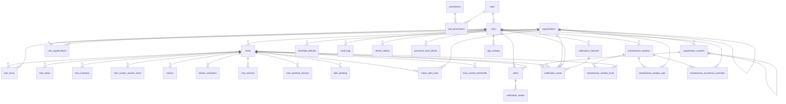

# Veritabanı şeması

PostgreSQL **15 veya üstü** (`UNIQUE NULLS NOT DISTINCT`, `ON DELETE SET NULL (sütun)`). Şema
`server/migrations/000001_baseline.up.sql` ile kurulur; sonraki her değişiklik `000002`'den başlayan yeni bir dosyadır
(bkz. `docs/DEPLOYMENT.md`, "Veritabanı migration'ları"). Bu belge o dosyadan **taze bir veritabanına migration
uygulanarak** üretilmiştir; şema değişince tablo ayrıntılarını yeniden üretin (bu belgenin sonundaki not).

## Kavramlar

- **Organizasyon ağacı.** Organizasyonlar üst şirket → alt şirketler diye bir ağaç oluşturur. Bir `org_admin` bir
  organizasyona atanırsa o organizasyonun **ve altındaki tüm dalın** sunucularını yönetir; üst zincirini yalnızca adıyla
  (bilgi olarak) görür, kardeş dalları hiç görmez. Organizasyonu taşımak (üst şirketini değiştirmek) yalnızca `super_admin`'dir.
- **Sunucu (`hosts`)** agent'ın çalıştığı izlenen makinedir; üç tabloya yayılır: `hosts` (kimlik ve bağlantı ayarı, nadiren
  değişir), `host_status` (anlık durum, her raporda güncellenen küçük satır) ve `host_inventory` (yavaş değişen envanter,
  yalnızca içerik değişince yazılır). Panelde görünen ad `hosts.title`'dır; makinenin kendi hostname'i envanterdedir.
- **Eşik mirası.** Bir sunucu için geçerli eşik: sunucunun kendi eşiği → organizasyonun varsayılanı → üst şirketlerin
  varsayılanı (en yakın olan) → genel varsayılan. Hiçbiri yoksa o metrik alert üretmez. Eşiği olmayan durum alert'lerinin
  seviyesi ve süresi (`status_alert_rules`, `000007`) aynı zincirle çözülür; hiç satır yoksa kural kapalıdır.
- **Protokol 4 verisi** (`000007`): zaman serisi metrik satırının JSONB sütunlarında (`system_json`, `disk_io_json`,
  `net_io_json`), geçmişi tutulmayan anlık durumlar `host_status.system_state`'te, systemd servisleri `host_services`'te.
  Değerler ölçüldüğü gibi saklanır; yuvarlama panelde yapılır.
- **Bildirimler.** Her alert'in bildirimi **sistem sahiplerine** (`notification_owners`) gider; `notification_routes`
  kuralları bunlara **ek alıcı** ekler. Alıcılar sahipler, sunucunun organizasyon zincirindeki (üst şirketler dahil) ve
  sunucunun kendi kurallarının **toplamıdır**; varsayılan alıcı yoktur. Kanallar (`notification_channels`) sistem
  düzeyindedir: ayarı ve şifreli sırrı orada, açık/kapalı durumu ve sahiplere hangi seviyeden itibaren gideceği
  (`owner_min_level`) oradadır. Kural yalnızca tanımlı bir kanala yazılabilir (yabancı anahtar); kanalı kapalı kural
  çalışmaz. Her alıcı ayrı ileti alır (`notification_outbox`'ta alıcı başına bir satır). Bkz. `docs/MIMARI.md` bölüm 8.
- **Çalışma zamanı ayarları.** Panelden değişen işletim ayarları (`app_settings`, tek satır) veritabanındadır; varsayılanları
  sütunların `DEFAULT`'ları, sınırları `CHECK`'lerdir ("varsayılana dön" = `SET sütun = DEFAULT`).
- **Bakım pencereleri** (`000008`): `maintenance_windows` ve kapsamı (`maintenance_window_hosts`,
  `maintenance_window_orgs`), tek tekrarın istisnaları `maintenance_occurrence_overrides`. Bakımdaki sunucunun bildirimi
  ertelenir (`alerts.notify_pending`); tekrarlar `app_settings.timezone`'a göre hesaplanır.
- **Çift kayıt.** `host_inventory.machine_id_hash` aynı makinenin iki kez kaydedilmesini yakalamak için indekslidir; benzersiz
  değildir (klonlanmış sanal makineler aynı kimliği taşır). Panel yalnızca uyarır.

## İlişkiler

```mermaid
erDiagram
    permissions ||--o{ role_permissions : ""
    roles ||--o{ role_permissions : ""
    roles ||--o{ users : ""
    organizations ||--o{ organizations : ""
    organization_contacts ||--o{ organization_contacts : ""
    organizations ||--o{ organization_contacts : ""
    organizations ||--o{ user_organizations : ""
    users ||--o{ user_organizations : ""
    organizations ||--o{ hosts : ""
    hosts ||--o{ user_hosts : ""
    users ||--o{ user_hosts : ""
    hosts ||--o{ host_status : ""
    hosts ||--o{ host_inventory : ""
    hosts ||--o{ host_custom_mounts_alerts : ""
    hosts ||--o{ metrics : ""
    hosts ||--o{ docker_containers : ""
    hosts ||--o{ host_services : ""
    hosts ||--o{ host_watched_services : ""
    hosts ||--o{ alert_pending : ""
    hosts ||--o{ status_alert_rules : ""
    organizations ||--o{ status_alert_rules : ""
    organizations ||--o{ threshold_defaults : ""
    hosts ||--o{ host_custom_thresholds : ""
    users ||--o{ alerts : ""
    hosts ||--o{ alerts : ""
    organization_contacts ||--o{ notification_routes : ""
    hosts ||--o{ notification_routes : ""
    organizations ||--o{ notification_routes : ""
    users ||--o{ notification_routes : ""
    users ||--o{ audit_logs : ""
    users ||--o{ refresh_tokens : ""
    users ||--o{ password_reset_tokens : ""
    alerts ||--o{ notification_outbox : ""
    notification_channels ||--o{ notification_routes : ""
    users ||--o{ app_settings : ""
    users ||--o{ notification_channels : ""
    users ||--o{ maintenance_windows : ""
    maintenance_windows ||--o{ maintenance_window_hosts : ""
    hosts ||--o{ maintenance_window_hosts : ""
    maintenance_windows ||--o{ maintenance_window_orgs : ""
    organizations ||--o{ maintenance_window_orgs : ""
    maintenance_windows ||--o{ maintenance_occurrence_overrides : ""
    users ||--o{ maintenance_occurrence_overrides : ""
```

## Tablolar

### `roles`

Sabit roller (`super_admin`, `org_admin`, `operator`); yeni rol eklemek için yeni satır yeter.

| Sütun | Tip | Boş olabilir | Varsayılan |
| --- | --- | --- | --- |
| `key` | text | hayır |  |
| `description` | text | hayır |  |

- **PK** (key)

### `permissions`

Yetki anahtarları (`host.view`, `alert.acknowledge`, …). Kod izni sabit rolden değil bu tablodan denetler.
Sistem Araçları'nın her aracı ayrı bir izindir (`000006`): `system.queue.view`, `system.cache.view`, `system.logs.view`;
üçü de yalnızca `super_admin`'e verilir.
Bakım pencereleri (`000008`): `maintenance.view` üç role, `maintenance.manage` `super_admin` ve `org_admin`'e verilir.

| Sütun | Tip | Boş olabilir | Varsayılan |
| --- | --- | --- | --- |
| `key` | text | hayır |  |
| `description` | text | hayır |  |

- **PK** (key)

### `role_permissions`

Hangi rolün hangi izne sahip olduğu.

| Sütun | Tip | Boş olabilir | Varsayılan |
| --- | --- | --- | --- |
| `role` | text | hayır |  |
| `permission_key` | text | hayır |  |

- **FK** (permission_key) REFERENCES permissions(key) ON DELETE CASCADE
- **FK** (role) REFERENCES roles(key) ON DELETE CASCADE
- **PK** (role, permission_key)

### `users`

Panele giriş yapan hesaplar. Giriş e-postayla yapılır (küçük harfe normalize); `full_name` görünen addır. Telefon SMS bildirimi, `two_factor_*` ileride iki faktörlü doğrulama için (henüz uygulanmadı, yalnızca saklanır).

| Sütun | Tip | Boş olabilir | Varsayılan |
| --- | --- | --- | --- |
| `id` | uuid | hayır | `gen_random_uuid()` |
| `email` | text | hayır |  |
| `full_name` | text | evet |  |
| `password_hash` | text | hayır |  |
| `role` | text | hayır |  |
| `phone` | text | evet |  |
| `two_factor_enabled` | boolean | hayır | `false` |
| `two_factor_channel` | text | evet |  |
| `must_change_password` | boolean | hayır | `false` |
| `created_at` | timestamptz | hayır | `now()` |
| `last_login_at` | timestamptz | evet |  |

- **CHECK** `users_email_lowercase_chk`: ((email = lower(email)))
- **CHECK** `users_two_factor_channel_check`: ((two_factor_channel = ANY (ARRAY['email'::text, 'sms'::text, 'app'::text])))
- **CHECK** `users_two_factor_channel_chk`: (((NOT two_factor_enabled) OR (two_factor_channel IS NOT NULL)))
- **FK** (role) REFERENCES roles(key)
- **PK** (id)
- **UNIQUE** `users_email_key`: (email)

### `organizations`

Müşteri/marka birimleri; **ağaç** oluşturur (`parent_organization_id`). Aynı üst şirketin altında ad benzersizdir; kök organizasyonlar arasında da. Döngü tetikleyiciyle engellenir.

| Sütun | Tip | Boş olabilir | Varsayılan |
| --- | --- | --- | --- |
| `id` | uuid | hayır | `gen_random_uuid()` |
| `parent_organization_id` | uuid | evet |  |
| `name` | text | hayır |  |
| `address` | text | evet |  |
| `created_at` | timestamptz | hayır | `now()` |

- **CHECK** `organizations_not_own_parent_chk`: ((parent_organization_id IS DISTINCT FROM id))
- **FK** (parent_organization_id) REFERENCES organizations(id) ON DELETE RESTRICT
- **PK** (id)
- **UNIQUE** `organizations_parent_name_key`: NULLS NOT DISTINCT (parent_organization_id, name)
- **İndeks** `organizations_parent_idx`: `btree (parent_organization_id)`
- **Tetikleyici** `organizations_no_cycle` (BEFORE INSERT)
- **Tetikleyici** `organizations_no_cycle` (BEFORE UPDATE)

### `organization_contacts`

Organizasyonun başvurulacak kişileri (panel kullanıcısı olmak zorunda değil): departman, unvan, yönetici (aynı organizasyondan), telefon/e-posta (en az biri). Bildirim kurallarında alıcı olabilir.

| Sütun | Tip | Boş olabilir | Varsayılan |
| --- | --- | --- | --- |
| `id` | uuid | hayır | `gen_random_uuid()` |
| `organization_id` | uuid | hayır |  |
| `department` | text | evet |  |
| `title` | text | evet |  |
| `name` | text | hayır |  |
| `manager_contact_id` | uuid | evet |  |
| `phone` | text | evet |  |
| `email` | text | evet |  |
| `created_at` | timestamptz | hayır | `now()` |
| `updated_at` | timestamptz | hayır | `now()` |

- **CHECK** `organization_contacts_not_own_manager_chk`: ((manager_contact_id IS DISTINCT FROM id))
- **CHECK** `organization_contacts_reachable_chk`: (((phone IS NOT NULL) OR (email IS NOT NULL)))
- **FK** (organization_id, manager_contact_id) REFERENCES organization_contacts(organization_id, id) ON DELETE SET NULL (manager_contact_id)
- **FK** (organization_id) REFERENCES organizations(id) ON DELETE CASCADE
- **PK** (id)
- **UNIQUE** `organization_contacts_org_id_key`: (organization_id, id)

### `user_organizations`

org_admin'in atandığı organizasyonlar. Atama **aşağıya miras kalır**: atanan organizasyonun tüm alt dalı da yönetilir.

| Sütun | Tip | Boş olabilir | Varsayılan |
| --- | --- | --- | --- |
| `user_id` | uuid | hayır |  |
| `organization_id` | uuid | hayır |  |

- **FK** (organization_id) REFERENCES organizations(id) ON DELETE CASCADE
- **FK** (user_id) REFERENCES users(id) ON DELETE CASCADE
- **PK** (user_id, organization_id)
- **İndeks** `user_organizations_organization_id_idx`: `btree (organization_id)`

### `hosts`

İzlenen makine (agent'ın çalıştığı sunucu): kimlik ve bağlantı ayarı, nadiren değişir. `title` panelde görünen addır (organizasyon içinde benzersiz); makinenin kendi bildirdiği hostname `host_inventory`'dedir.

| Sütun | Tip | Boş olabilir | Varsayılan |
| --- | --- | --- | --- |
| `id` | uuid | hayır | `gen_random_uuid()` |
| `organization_id` | uuid | hayır |  |
| `title` | text | hayır |  |
| `ip` | inet | hayır |  |
| `mode` | text | hayır |  |
| `interval_seconds` | integer | hayır |  |
| `api_token_hash` | text | evet |  |
| `pull_port` | integer | evet |  |
| `pull_endpoint` | text | evet |  |
| `pull_secret_enc` | text | evet |  |
| `all_mounts_alert` | boolean | hayır | `true` |
| `created_at` | timestamptz | hayır | `now()` |
| `updated_at` | timestamptz | hayır | `now()` |

- **CHECK** `hosts_interval_seconds_check`: ((interval_seconds > 0))
- **CHECK** `hosts_mode_check`: ((mode = ANY (ARRAY['push'::text, 'pull'::text])))
- **CHECK** `hosts_pull_fields_chk`: (((mode <> 'pull'::text) OR ((pull_port IS NOT NULL) AND (pull_endpoint IS NOT NULL) AND (pull_secret_enc IS NOT NULL))))
- **CHECK** `hosts_pull_port_check`: (((pull_port IS NULL) OR ((pull_port > 0) AND (pull_port <= 65535))))
- **CHECK** `hosts_push_fields_chk`: (((mode <> 'push'::text) OR (api_token_hash IS NOT NULL)))
- **FK** (organization_id) REFERENCES organizations(id) ON DELETE RESTRICT
- **PK** (id)
- **UNIQUE** `hosts_org_title_key`: (organization_id, title)
- **İndeks** `hosts_organization_id_idx`: `btree (organization_id)`

### `user_hosts`

Operatörün atandığı sunucular (organizasyon bazlı toplu atama da satır satır buraya yazılır).

| Sütun | Tip | Boş olabilir | Varsayılan |
| --- | --- | --- | --- |
| `user_id` | uuid | hayır |  |
| `host_id` | uuid | hayır |  |

- **FK** (host_id) REFERENCES hosts(id) ON DELETE CASCADE
- **FK** (user_id) REFERENCES users(id) ON DELETE CASCADE
- **PK** (user_id, host_id)
- **İndeks** `user_hosts_host_id_idx`: `btree (host_id)`

### `host_status`

Anlık durum ve her raporda değişen bilgiler (`runtime`: uptime, yük, swap…). Her rapor yalnızca bu küçük satırı günceller.
`system_state` (`000007`): protokol 4'ün geçmişi tutulmayan anlık durumları (sıcaklık, RAID, kapasite, süreçler, bekleyen
güncellemeler, saat senkronu, OOM sayacı ve son artış anı); her rapor son bildirilenle değiştirir.

| Sütun | Tip | Boş olabilir | Varsayılan |
| --- | --- | --- | --- |
| `host_id` | uuid | hayır |  |
| `status` | text | hayır | `'offline'::text` |
| `last_seen` | timestamptz | evet |  |
| `agent_version` | text | evet |  |
| `agent_protocol` | integer | evet |  |
| `unsupported_fields` | jsonb | evet |  |
| `runtime` | jsonb | evet |  |
| `updated_at` | timestamptz | hayır | `now()` |
| `system_state` | jsonb | evet |  |

- **CHECK** `host_status_status_check`: ((status = ANY (ARRAY['online'::text, 'offline'::text])))
- **FK** (host_id) REFERENCES hosts(id) ON DELETE CASCADE
- **PK** (host_id)

### `host_inventory`

Yavaş değişen envanter (hostname, machine-id özeti, CPU/RAM, fiziksel diskler, işletim sistemi…); yalnızca içerik değişince yazılır. `machine_id_hash` benzersiz **değildir** (klon VM'ler aynı kimliği taşır); panel çift kaydı uyarır.

| Sütun | Tip | Boş olabilir | Varsayılan |
| --- | --- | --- | --- |
| `host_id` | uuid | hayır |  |
| `hostname` | text | evet |  |
| `machine_id_hash` | text | evet |  |
| `cpu_cores` | integer | evet |  |
| `ram_total_mb` | bigint | evet |  |
| `physical_disks` | jsonb | evet |  |
| `info` | jsonb | evet |  |
| `updated_at` | timestamptz | hayır | `now()` |

- **FK** (host_id) REFERENCES hosts(id) ON DELETE CASCADE
- **PK** (host_id)
- **İndeks** `host_inventory_machine_id_idx`: `btree (machine_id_hash) WHERE (machine_id_hash IS NOT NULL)`

### `host_custom_mounts_alerts`

`hosts.all_mounts_alert = false` iken hangi mount'ların disk alert'i üreteceği.

| Sütun | Tip | Boş olabilir | Varsayılan |
| --- | --- | --- | --- |
| `host_id` | uuid | hayır |  |
| `mount` | text | hayır |  |

- **FK** (host_id) REFERENCES hosts(id) ON DELETE CASCADE
- **PK** (host_id, mount)

### `metrics`

Zaman serisi: sunucu başına CPU/RAM/disk örnekleri. Doğal anahtar `(host_id, recorded_at)`; ileride zamana göre partition'a açık.
Protokol 4 sütunları (`000007`; eski agent'ın satırlarında NULL): `system_json` CPU ve bellek ayrıntısı, PSI ve TCP;
`disk_io_json` fiziksel disk başına G/Ç; `net_io_json` arayüz başına trafik.

| Sütun | Tip | Boş olabilir | Varsayılan |
| --- | --- | --- | --- |
| `host_id` | uuid | hayır |  |
| `recorded_at` | timestamptz | hayır | `now()` |
| `cpu_usage_pct` | numeric | hayır |  |
| `ram_usage_pct` | numeric | hayır |  |
| `disk_json` | jsonb | hayır | `'[]'::jsonb` |
| `system_json` | jsonb | evet |  |
| `disk_io_json` | jsonb | evet |  |
| `net_io_json` | jsonb | evet |  |

- **CHECK** `metrics_cpu_usage_pct_check`: (((cpu_usage_pct >= (0)::numeric) AND (cpu_usage_pct <= (100)::numeric)))
- **CHECK** `metrics_ram_usage_pct_check`: (((ram_usage_pct >= (0)::numeric) AND (ram_usage_pct <= (100)::numeric)))
- **FK** (host_id) REFERENCES hosts(id) ON DELETE CASCADE
- **PK** (host_id, recorded_at)
- **İndeks** `metrics_recorded_at_idx`: `btree (recorded_at)`

### `docker_containers`

Container'ların **son durumu** (geçmiş tutulmaz). Protokol 4 (`000007`): healthcheck sonucu ve üst üste başarısız kontrol
sayısı, durmuş container'ın son çıkış kodu ve bellek yetmediği için öldürülüp öldürülmediği (NULL = bilinmiyor).

| Sütun | Tip | Boş olabilir | Varsayılan |
| --- | --- | --- | --- |
| `host_id` | uuid | hayır |  |
| `name` | text | hayır |  |
| `image` | text | hayır |  |
| `status` | text | hayır |  |
| `cpu_pct` | numeric | hayır |  |
| `ram_mb` | numeric | hayır |  |
| `restart_count` | integer | hayır | `0` |
| `uptime_seconds` | bigint | hayır | `0` |
| `reported_at` | timestamptz | hayır | `now()` |
| `health` | text | evet |  |
| `health_failing_streak` | integer | evet |  |
| `exit_code` | integer | evet |  |
| `oom_killed` | boolean | evet |  |

- **CHECK** `docker_containers_cpu_pct_check`: ((cpu_pct >= (0)::numeric))
- **CHECK** `docker_containers_health_check`: ((health = ANY (ARRAY['healthy'::text, 'unhealthy'::text, 'starting'::text])))
- **CHECK** `docker_containers_health_failing_streak_check`: ((health_failing_streak >= 0))
- **CHECK** `docker_containers_ram_mb_check`: ((ram_mb >= (0)::numeric))
- **CHECK** `docker_containers_restart_count_check`: ((restart_count >= 0))
- **CHECK** `docker_containers_status_check`: ((status = ANY (ARRAY['created'::text, 'running'::text, 'paused'::text, 'restarting'::text, 'exited'::text, 'dead'::text, 'removing'::text])))
- **CHECK** `docker_containers_uptime_seconds_check`: ((uptime_seconds >= 0))
- **FK** (host_id) REFERENCES hosts(id) ON DELETE CASCADE
- **PK** (host_id, name)

### `host_services`

systemd servislerinin **son durumu** (protokol 4, `000007`). Tam rapor listeyi değiştirir (listede olmayan silinir), kısmi
rapor yalnızca gelen servisleri günceller; `updated_at` içerik değişince ilerler (değişmeyen satır yazılmaz).
`restart_history`: son 1 saatteki yeniden başlatma sayacı artışları (`[[unix_sn, önceki, yeni], …]`; servis yeniden
başlatma döngüsü alert'i).

| Sütun | Tip | Boş olabilir | Varsayılan |
| --- | --- | --- | --- |
| `host_id` | uuid | hayır |  |
| `name` | text | hayır |  |
| `description` | text | evet |  |
| `active` | text | hayır |  |
| `sub` | text | evet |  |
| `since` | timestamptz | evet |  |
| `restarts` | integer | evet |  |
| `enabled` | text | evet |  |
| `updated_at` | timestamptz | hayır | `now()` |
| `restart_history` | jsonb | evet |  |

- **CHECK** `host_services_restarts_check`: ((restarts >= 0))
- **FK** (host_id) REFERENCES hosts(id) ON DELETE CASCADE
- **PK** (host_id, name)

### `host_watched_services`

Alert üretecek (izlenen) servisler, sunucu bazında (`000007`; izin `host.update`). Şu an raporlanmayan bir servis de
seçilebilir.

| Sütun | Tip | Boş olabilir | Varsayılan |
| --- | --- | --- | --- |
| `host_id` | uuid | hayır |  |
| `name` | text | hayır |  |
| `created_at` | timestamptz | hayır | `now()` |

- **FK** (host_id) REFERENCES hosts(id) ON DELETE CASCADE
- **PK** (host_id, name)

### `threshold_defaults`

Varsayılan eşikler: genel (`organization_id` NULL) ya da bir organizasyonun (alt dallara miras kalır). Çözümleme: sunucu özel → organizasyon → üst şirketler (en yakın) → genel.
`duration_seconds` (`000007`): eşik bu kadar saniye kesintisiz aşılırsa alert açılır; NULL = hemen (yalnızca protokol 4
türlerinde verilir: `disk_latency`, `temperature`, `service_restart`, `time_offset`).

| Sütun | Tip | Boş olabilir | Varsayılan |
| --- | --- | --- | --- |
| `id` | uuid | hayır | `gen_random_uuid()` |
| `organization_id` | uuid | evet |  |
| `metric_type` | text | hayır |  |
| `warning_level` | numeric | hayır |  |
| `critical_level` | numeric | hayır |  |
| `created_at` | timestamptz | hayır | `now()` |
| `updated_at` | timestamptz | hayır | `now()` |
| `duration_seconds` | integer | evet |  |

- **CHECK** `threshold_defaults_duration_seconds_check`: ((duration_seconds > 0))
- **CHECK** `threshold_defaults_levels_chk`: ((warning_level <= critical_level))
- **CHECK** `threshold_defaults_metric_type_check`: ((metric_type = ANY (ARRAY['cpu'::text, 'ram'::text, 'disk'::text, 'docker_restart'::text, 'disk_latency'::text, 'temperature'::text, 'service_restart'::text, 'time_offset'::text])))
- **FK** (organization_id) REFERENCES organizations(id) ON DELETE CASCADE
- **PK** (id)
- **UNIQUE** `threshold_defaults_scope_metric_key`: NULLS NOT DISTINCT (organization_id, metric_type)

### `host_custom_thresholds`

Bir sunucunun kendi eşikleri; `subject` doluysa mount (`disk`), container (`docker_restart`), fiziksel disk
(`disk_latency`), sensör (`temperature`) ya da servis (`service_restart`) başına. `duration_seconds` için bkz.
`threshold_defaults`.

| Sütun | Tip | Boş olabilir | Varsayılan |
| --- | --- | --- | --- |
| `id` | uuid | hayır | `gen_random_uuid()` |
| `host_id` | uuid | hayır |  |
| `metric_type` | text | hayır |  |
| `subject` | text | evet |  |
| `warning_level` | numeric | hayır |  |
| `critical_level` | numeric | hayır |  |
| `created_at` | timestamptz | hayır | `now()` |
| `updated_at` | timestamptz | hayır | `now()` |
| `duration_seconds` | integer | evet |  |

- **CHECK** `host_custom_thresholds_duration_seconds_check`: ((duration_seconds > 0))
- **CHECK** `host_custom_thresholds_levels_chk`: ((warning_level <= critical_level))
- **CHECK** `host_custom_thresholds_metric_type_check`: ((metric_type = ANY (ARRAY['cpu'::text, 'ram'::text, 'disk'::text, 'docker_restart'::text, 'disk_latency'::text, 'temperature'::text, 'service_restart'::text, 'time_offset'::text])))
- **CHECK** `host_custom_thresholds_subject_chk`: (((subject IS NULL) OR (metric_type = ANY (ARRAY['disk'::text, 'docker_restart'::text, 'disk_latency'::text, 'temperature'::text, 'service_restart'::text]))))
- **FK** (host_id) REFERENCES hosts(id) ON DELETE CASCADE
- **PK** (id)
- **UNIQUE** `host_custom_thresholds_key`: NULLS NOT DISTINCT (host_id, metric_type, subject)

### `status_alert_rules`

Durum kuralları (`000007`): eşiği olmayan alert'lerin seviyesi (`off` / `info` / `warning` / `critical`) ve süresi. Kapsam
genel (iki kimlik de NULL), organizasyon (alt dallara miras kalır) ya da tek sunucu; en özel olan geçerlidir, `off` üst
kapsamdaki kuralı o kapsamda kapatır. Hiç satır yoksa kural kapalıdır. `duration_seconds`: koşul bu kadar sürerse alert
açılır (`oom_kill`'de: bu kadar süre yeni olay olmazsa kapanır); anlık olaylara (`container_oom`, `fs_readonly`,
`reboot_required`) süre verilmez.

| Sütun | Tip | Boş olabilir | Varsayılan |
| --- | --- | --- | --- |
| `id` | uuid | hayır | `gen_random_uuid()` |
| `organization_id` | uuid | evet |  |
| `host_id` | uuid | evet |  |
| `rule` | text | hayır |  |
| `level` | text | hayır |  |
| `duration_seconds` | integer | evet |  |
| `created_at` | timestamptz | hayır | `now()` |
| `updated_at` | timestamptz | hayır | `now()` |

- **CHECK** `status_alert_rules_duration_chk`: (((duration_seconds IS NULL) OR (rule <> ALL (ARRAY['container_oom'::text, 'fs_readonly'::text, 'reboot_required'::text]))))
- **CHECK** `status_alert_rules_duration_seconds_check`: ((duration_seconds > 0))
- **CHECK** `status_alert_rules_level_check`: ((level = ANY (ARRAY['off'::text, 'info'::text, 'warning'::text, 'critical'::text])))
- **CHECK** `status_alert_rules_one_scope_chk`: (((organization_id IS NULL) OR (host_id IS NULL)))
- **CHECK** `status_alert_rules_rule_check`: ((rule = ANY (ARRAY['service_failed'::text, 'container_unhealthy'::text, 'container_oom'::text, 'oom_kill'::text, 'fs_readonly'::text, 'raid_degraded'::text, 'raid_rebuilding'::text, 'time_unsynced'::text, 'time_source'::text, 'reboot_required'::text, 'security_updates'::text])))
- **FK** (host_id) REFERENCES hosts(id) ON DELETE CASCADE
- **FK** (organization_id) REFERENCES organizations(id) ON DELETE CASCADE
- **PK** (id)
- **UNIQUE** `status_alert_rules_key`: NULLS NOT DISTINCT (organization_id, host_id, rule)
- **İndeks** `status_alert_rules_host_idx`: `btree (host_id) WHERE (host_id IS NOT NULL)`

### `alerts`

Alert kayıtları. Sunucu+tür+subject başına en fazla **bir açık** alert (kısmi benzersiz indeks). `value`/`threshold` tetiklendiği andaki ölçüm ve eşik.
`notify_pending` (`000008`): bir olayın (açılma, seviye değişimi) bildirimi sunucu bakımdayken gönderilmedi; sunucu
bakımdan çıkınca hâlâ aktif olan alert'in güncel durumu bildirilir ve bayrak kalkar. Bakımda çözülen alert'in bayrağı da
kalkar (çözülmesi bildirilmez).

| Sütun | Tip | Boş olabilir | Varsayılan |
| --- | --- | --- | --- |
| `id` | uuid | hayır | `gen_random_uuid()` |
| `host_id` | uuid | hayır |  |
| `alert_type` | text | hayır |  |
| `subject` | text | evet |  |
| `level` | text | hayır |  |
| `status` | text | hayır | `'open'::text` |
| `value` | numeric | evet |  |
| `threshold` | numeric | evet |  |
| `created_at` | timestamptz | hayır | `now()` |
| `acknowledged_at` | timestamptz | evet |  |
| `acknowledged_by` | uuid | evet |  |
| `resolved_at` | timestamptz | evet |  |
| `notify_pending` | boolean | hayır | `false` |

- **CHECK** `alerts_alert_type_check`: ((alert_type = ANY (ARRAY['cpu'::text, 'ram'::text, 'disk'::text, 'docker_restart'::text, 'host_offline'::text, 'disk_missing'::text, 'service_failed'::text, 'service_restart_loop'::text, 'container_unhealthy'::text, 'container_oom'::text, 'disk_latency'::text, 'oom_kill'::text, 'fs_readonly'::text, 'raid_degraded'::text, 'temperature'::text, 'time_sync'::text, 'reboot_required'::text, 'security_updates'::text])))
- **CHECK** `alerts_level_check`: ((level = ANY (ARRAY['info'::text, 'warning'::text, 'critical'::text])))
- **CHECK** `alerts_status_check`: ((status = ANY (ARRAY['open'::text, 'acknowledged'::text, 'resolved'::text])))
- **FK** (acknowledged_by) REFERENCES users(id) ON DELETE SET NULL
- **FK** (host_id) REFERENCES hosts(id) ON DELETE CASCADE
- **PK** (id)
- **İndeks** `alerts_host_id_idx`: `btree (host_id)`
- **İndeks** `alerts_notify_pending_idx`: `btree (host_id) WHERE notify_pending` — bildirimi bakım yüzünden ertelenmiş alert'ler (`000008`)
- **Benzersiz indeks** `alerts_one_active_uidx`: `btree (host_id, alert_type, subject) NULLS NOT DISTINCT WHERE (status <> 'resolved'::text)` — bir sunucu + tür + konu için en fazla bir aktif (açık ya da onaylanmış) alert (`000002`)
- **İndeks** `alerts_resolved_at_idx`: `btree (resolved_at) WHERE (status = 'resolved'::text)` — çözülmüş alert saklama temizliği için (`000004`)
- **İndeks** `alerts_status_idx`: `btree (status)`

### `alert_pending`

Süre koşulu henüz dolmamış durumlar (`000007`): eşik aşıldı ya da durum oluştu ama `duration_seconds` dolmadı. Koşul
`since`'tan beri sürüyorsa alert açılır ve satır silinir; koşul kalkınca da silinir. Anahtar `alerts`'teki tek aktif alert
kuralıyla aynıdır (sunucu + tür + konu). Server yeniden başlasa da süre korunur.

| Sütun | Tip | Boş olabilir | Varsayılan |
| --- | --- | --- | --- |
| `host_id` | uuid | hayır |  |
| `alert_type` | text | hayır |  |
| `subject` | text | evet |  |
| `level` | text | hayır |  |
| `since` | timestamptz | hayır | `now()` |

- **CHECK** `alert_pending_level_check`: ((level = ANY (ARRAY['info'::text, 'warning'::text, 'critical'::text])))
- **FK** (host_id) REFERENCES hosts(id) ON DELETE CASCADE
- **UNIQUE** `alert_pending_key`: NULLS NOT DISTINCT (host_id, alert_type, subject)

### `maintenance_windows`

Bakım pencereleri (`000008`): pencere sürerken kapsamındaki sunucuların alert'leri kaydedilir, bildirimi gönderilmez
(bkz. `alerts.notify_pending`). `recurrence = 'once'` mutlak aralıktır (`starts_at`–`ends_at`). Diğerleri kurulumun saat
diliminde (`app_settings.timezone`) tekrar eder: `valid_from` gününden (sayımın çapası, geçmiş bir gün olabilir) başlayarak
her `repeat_every` gün / hafta / ayda bir, gün içinde `start_minute`'te başlar ve `duration_minutes` sürer (gece yarısını
geçebilir; günlükte en çok 24 saat, haftalık ve aylıkta 7 gün). Haftalıkta günler `weekdays` bit maskesidir (bit 0 =
Pazartesi … bit 6 = Pazar). Aylıkta ya ayın günü (`month_day`: 1–28, -1 = son gün) ya da ayın n'inci haftanın günü
(`month_week`: 1–4, -1 = son; `month_weekday`: 1 = Pazartesi … 7 = Pazar). `ended_at` "pencereyi bitir" anıdır: seriyi
kapatır, süren tekrarı da o anda bitirir; bitirilmiş pencere düzenlenemez, silinebilir.

| Sütun | Tip | Boş olabilir | Varsayılan |
| --- | --- | --- | --- |
| `id` | uuid | hayır | `gen_random_uuid()` |
| `title` | text | hayır |  |
| `recurrence` | text | hayır |  |
| `starts_at` | timestamptz | evet |  |
| `ends_at` | timestamptz | evet |  |
| `start_minute` | smallint | evet |  |
| `duration_minutes` | integer | evet |  |
| `repeat_every` | smallint | hayır | `1` |
| `weekdays` | smallint | evet |  |
| `month_day` | smallint | evet |  |
| `month_week` | smallint | evet |  |
| `month_weekday` | smallint | evet |  |
| `valid_from` | date | evet |  |
| `valid_until` | date | evet |  |
| `ended_at` | timestamptz | evet |  |
| `created_by` | uuid | evet |  |
| `created_at` | timestamptz | hayır | `now()` |
| `updated_at` | timestamptz | hayır | `now()` |

- **CHECK** `maintenance_windows_duration_chk`: (((duration_minutes >= 1) AND (duration_minutes <= CASE recurrence WHEN 'daily'::text THEN 1440 ELSE 10080 END)))
- **CHECK** `maintenance_windows_month_day_check`: ((((month_day >= 1) AND (month_day <= 28)) OR (month_day = '-1'::integer)))
- **CHECK** `maintenance_windows_month_week_check`: ((((month_week >= 1) AND (month_week <= 4)) OR (month_week = '-1'::integer)))
- **CHECK** `maintenance_windows_month_weekday_check`: (((month_weekday >= 1) AND (month_weekday <= 7)))
- **CHECK** `maintenance_windows_monthly_chk`: ((((recurrence = 'monthly'::text) = ((month_day IS NOT NULL) OR (month_week IS NOT NULL))) AND (NOT ((month_day IS NOT NULL) AND (month_week IS NOT NULL))) AND ((month_week IS NULL) = (month_weekday IS NULL))))
- **CHECK** `maintenance_windows_range_chk`: ((ends_at > starts_at))
- **CHECK** `maintenance_windows_recurrence_check`: ((recurrence = ANY (ARRAY['once'::text, 'daily'::text, 'weekly'::text, 'monthly'::text])))
- **CHECK** `maintenance_windows_repeat_every_chk`: (((repeat_every >= 1) AND (repeat_every <= CASE recurrence WHEN 'once'::text THEN 1 WHEN 'daily'::text THEN 30 ELSE 12 END)))
- **CHECK** `maintenance_windows_shape_chk`: (CASE WHEN (recurrence = 'once'::text) THEN ((starts_at IS NOT NULL) AND (ends_at IS NOT NULL) AND (start_minute IS NULL) AND (duration_minutes IS NULL) AND (valid_from IS NULL) AND (valid_until IS NULL)) ELSE ((starts_at IS NULL) AND (ends_at IS NULL) AND (start_minute IS NOT NULL) AND (duration_minutes IS NOT NULL) AND (valid_from IS NOT NULL)) END)
- **CHECK** `maintenance_windows_start_minute_check`: (((start_minute >= 0) AND (start_minute <= 1439)))
- **CHECK** `maintenance_windows_title_check`: (((length(btrim(title)) >= 1) AND (length(btrim(title)) <= 200)))
- **CHECK** `maintenance_windows_valid_range_chk`: ((valid_until >= valid_from))
- **CHECK** `maintenance_windows_weekdays_check`: (((weekdays >= 1) AND (weekdays <= 127)))
- **CHECK** `maintenance_windows_weekdays_chk`: (((recurrence = 'weekly'::text) = (weekdays IS NOT NULL)))
- **FK** (created_by) REFERENCES users(id) ON DELETE SET NULL
- **PK** (id)

### `maintenance_window_hosts`

Bakım penceresinin kapsamındaki sunucular (`000008`).

| Sütun | Tip | Boş olabilir | Varsayılan |
| --- | --- | --- | --- |
| `window_id` | uuid | hayır |  |
| `host_id` | uuid | hayır |  |

- **FK** (host_id) REFERENCES hosts(id) ON DELETE CASCADE
- **FK** (window_id) REFERENCES maintenance_windows(id) ON DELETE CASCADE
- **PK** (window_id, host_id)
- **İndeks** `maintenance_window_hosts_host_idx`: `btree (host_id)`

### `maintenance_window_orgs`

Bakım penceresinin kapsamındaki organizasyonlar (`000008`). Organizasyon yalnızca **doğrudan bağlı** sunucularını
kapsar; alt organizasyonlar ayrıca seçilir. Kapsam alert anında değerlendirilir: sonradan eklenen sunucu da girer.

| Sütun | Tip | Boş olabilir | Varsayılan |
| --- | --- | --- | --- |
| `window_id` | uuid | hayır |  |
| `organization_id` | uuid | hayır |  |

- **FK** (organization_id) REFERENCES organizations(id) ON DELETE CASCADE
- **FK** (window_id) REFERENCES maintenance_windows(id) ON DELETE CASCADE
- **PK** (window_id, organization_id)
- **İndeks** `maintenance_window_orgs_org_idx`: `btree (organization_id)`

### `maintenance_occurrence_overrides`

Tekrarlı bir pencerenin tek bir tekrarının istisnası (`000008`): "Sıradaki tekrarı atla" ya da "Bu tekrarı bitir".
`occurrence_start` o tekrarın başladığı (başlayacağı) andır; `ended_at` boşsa tekrar atlanmıştır, doluysa o anda erken
bitirilmiştir.

| Sütun | Tip | Boş olabilir | Varsayılan |
| --- | --- | --- | --- |
| `window_id` | uuid | hayır |  |
| `occurrence_start` | timestamptz | hayır |  |
| `ended_at` | timestamptz | evet |  |
| `created_by` | uuid | evet |  |
| `created_at` | timestamptz | hayır | `now()` |

- **FK** (created_by) REFERENCES users(id) ON DELETE SET NULL
- **FK** (window_id) REFERENCES maintenance_windows(id) ON DELETE CASCADE
- **PK** (window_id, occurrence_start)

### `notification_routes`

Bildirim kuralları (sistem sahiplerine **ek** alıcılar): kapsam (organizasyon **ya da** sunucu) × alıcı (kullanıcı **ya da**
kişi) × kanal × en düşük seviye. Bir alert'e sunucunun ve organizasyon zincirinin bütün kuralları birlikte uygulanır. Kanal
`notification_channels`'ta tanımlı olmalıdır (`000005`); API ayrıca açık ve kişiye giden bir kanal ister.

| Sütun | Tip | Boş olabilir | Varsayılan |
| --- | --- | --- | --- |
| `id` | uuid | hayır | `gen_random_uuid()` |
| `organization_id` | uuid | evet |  |
| `host_id` | uuid | evet |  |
| `user_id` | uuid | evet |  |
| `contact_id` | uuid | evet |  |
| `channel` | text | hayır | `'email'::text` |
| `min_level` | text | hayır | `'warning'::text` |
| `created_at` | timestamptz | hayır | `now()` |

- **CHECK** `notification_routes_min_level_check`: ((min_level = ANY (ARRAY['info'::text, 'warning'::text, 'critical'::text])))
- **CHECK** `notification_routes_one_recipient_chk`: (((user_id IS NOT NULL) <> (contact_id IS NOT NULL)))
- **CHECK** `notification_routes_one_scope_chk`: (((organization_id IS NOT NULL) <> (host_id IS NOT NULL)))
- **FK** (channel) REFERENCES notification_channels(channel)
- **FK** (contact_id) REFERENCES organization_contacts(id) ON DELETE CASCADE
- **FK** (host_id) REFERENCES hosts(id) ON DELETE CASCADE
- **FK** (organization_id) REFERENCES organizations(id) ON DELETE CASCADE
- **FK** (user_id) REFERENCES users(id) ON DELETE CASCADE
- **PK** (id)
- **UNIQUE** `notification_routes_unique`: NULLS NOT DISTINCT (organization_id, host_id, user_id, contact_id, channel)
- **İndeks** `notification_routes_host_idx`: `btree (host_id) WHERE (host_id IS NOT NULL)`
- **İndeks** `notification_routes_organization_idx`: `btree (organization_id) WHERE (organization_id IS NOT NULL)`

### `audit_logs`

Kritik işlemlerin denetim kaydı (kim, ne zaman, hangi IP'den, neyi).

| Sütun | Tip | Boş olabilir | Varsayılan |
| --- | --- | --- | --- |
| `id` | uuid | hayır | `gen_random_uuid()` |
| `user_id` | uuid | evet |  |
| `actor_email` | text | hayır |  |
| `action` | text | hayır |  |
| `target_type` | text | hayır |  |
| `target_id` | text | evet |  |
| `details` | jsonb | evet |  |
| `ip` | inet | evet |  |
| `created_at` | timestamptz | hayır | `now()` |

- **FK** (user_id) REFERENCES users(id) ON DELETE SET NULL
- **PK** (id)
- **İndeks** `audit_logs_created_at_idx`: `btree (created_at DESC)`
- **İndeks** `audit_logs_target_idx`: `btree (target_type, target_id)`
- **İndeks** `audit_logs_user_id_idx`: `btree (user_id)`

### `refresh_tokens`

Panel oturumları (yalnızca token özeti saklanır; aile bazlı iptal).

| Sütun | Tip | Boş olabilir | Varsayılan |
| --- | --- | --- | --- |
| `jti` | uuid | hayır |  |
| `user_id` | uuid | hayır |  |
| `family_id` | uuid | hayır |  |
| `expires_at` | timestamptz | hayır |  |
| `rotated_at` | timestamptz | evet |  |
| `revoked_at` | timestamptz | evet |  |
| `created_at` | timestamptz | hayır | `now()` |

- **FK** (user_id) REFERENCES users(id) ON DELETE CASCADE
- **PK** (jti)
- **İndeks** `refresh_tokens_expires_at_idx`: `btree (expires_at)`
- **İndeks** `refresh_tokens_family_id_idx`: `btree (family_id)`
- **İndeks** `refresh_tokens_user_id_idx`: `btree (user_id)`

### `password_reset_tokens`

E-posta ile şifre sıfırlama: tek kullanımlık, kısa ömürlü, yalnızca SHA-256 özeti saklanır.

| Sütun | Tip | Boş olabilir | Varsayılan |
| --- | --- | --- | --- |
| `id` | uuid | hayır | `gen_random_uuid()` |
| `user_id` | uuid | hayır |  |
| `token_hash` | text | hayır |  |
| `expires_at` | timestamptz | hayır |  |
| `used_at` | timestamptz | evet |  |
| `created_at` | timestamptz | hayır | `now()` |

- **FK** (user_id) REFERENCES users(id) ON DELETE CASCADE
- **PK** (id)
- **UNIQUE** `password_reset_tokens_token_hash_key`: (token_hash)
- **İndeks** `password_reset_tokens_expires_at_idx`: `btree (expires_at)`
- **İndeks** `password_reset_tokens_user_id_idx`: `btree (user_id)`

### `notification_outbox`

Bildirim kuyruğu (`000003`): alert bildirimleri ve hesap e-postaları gönderilmeden önce buraya yazılır; işçi satırları alıp
gönderir, başarısızlıkta geri çekilerek yeniden dener (en çok 10 deneme). Alert bildirimleri alert değişikliğiyle aynı
transaction'da, **alıcı başına bir satır** olarak yazılır (`000005` bekleyen çok alıcılı satırları böldü; `recipients` artık
tek alıcı taşır); `alert_event` (açılma / seviye değişimi / çözülme) ve
`alert_level` hangi olay için, hangi seviyede gittiğini tutar (alert başına bildirim geçmişi). Şifre sıfırlama bağlantısı yalnızca şifreli (`body_sealed`,
`SECRETS_ENCRYPTION_KEY`, satır kimliğine bağlı) saklanır ve satır bitince silinir. Alert bildirimleri alert durdukça
gövdesiyle saklanır (alert'in bildirim geçmişi); hesap e-postaları ve alert'i silinmiş satırlar bittikten 30 gün sonra silinir.

| Sütun | Tip | Boş olabilir | Varsayılan |
| --- | --- | --- | --- |
| `id` | uuid | hayır |  |
| `kind` | text | hayır |  |
| `channel` | text | hayır |  |
| `recipients` | text[] | hayır |  |
| `subject` | text | hayır |  |
| `body` | text | evet |  |
| `body_sealed` | text | evet |  |
| `alert_id` | uuid | evet |  |
| `alert_event` | text | evet |  |
| `alert_level` | text | evet |  |
| `request_id` | text | evet |  |
| `attempts` | integer | hayır | `0` |
| `next_attempt_at` | timestamptz | hayır | `now()` |
| `expires_at` | timestamptz | evet |  |
| `last_error` | text | evet |  |
| `sent_at` | timestamptz | evet |  |
| `failed_at` | timestamptz | evet |  |
| `created_at` | timestamptz | hayır | `now()` |

- **CHECK** `notification_outbox_alert_event_check`: ((alert_event = ANY (ARRAY['opened'::text, 'level_changed'::text, 'resolved'::text])))
- **CHECK** `notification_outbox_alert_event_chk`: (((kind = 'alert'::text) = ((alert_event IS NOT NULL) AND (alert_level IS NOT NULL)))) — alert bildiriminin olayı ve o andaki seviyesi vardır, hesap e-postalarının yoktur
- **CHECK** `notification_outbox_alert_level_check`: ((alert_level = ANY (ARRAY['info'::text, 'warning'::text, 'critical'::text])))
- **CHECK** `notification_outbox_body_chk`: ((((sent_at IS NULL) AND (failed_at IS NULL) AND ((body IS NULL) <> (body_sealed IS NULL))) OR (((sent_at IS NOT NULL) OR (failed_at IS NOT NULL)) AND (body_sealed IS NULL)))) — bekleyen satırın tam olarak bir gövdesi vardır; bitmiş satır şifreli gövde tutamaz
- **CHECK** `notification_outbox_kind_check`: ((kind = ANY (ARRAY['alert'::text, 'password_reset'::text, 'password_changed'::text])))
- **FK** (alert_id) REFERENCES alerts(id) ON DELETE SET NULL
- **PK** (id)
- **İndeks** `notification_outbox_alert_id_idx`: `btree (alert_id) WHERE (alert_id IS NOT NULL)`
- **İndeks** `notification_outbox_created_at_idx`: `btree (created_at)`
- **İndeks** `notification_outbox_due_idx`: `btree (next_attempt_at) WHERE ((sent_at IS NULL) AND (failed_at IS NULL))`

### `app_settings`

Panelden (Ayarlar) değişen çalışma zamanı ayarları (`000005`): **tek satır** (`id = 1`). Varsayılanlar sütunların
`DEFAULT`'larıdır, sınırlar `CHECK`'lerdir; server açılışta okur, değişince yeniden başlatmadan uygular. Süreler saniyedir;
`NULL` sürüm "tanımsız" demektir. Bkz. `docs/DEPLOYMENT.md` §2.1. `timezone` (`000008`) kurulumun saat dilimidir (IANA
adı, ör. `Europe/Istanbul`): tekrarlı bakım pencereleri ve e-postalardaki saatler buna göredir; boşsa server sürecinin `TZ`'si,
o da yoksa UTC. Adın geçerliliğini server denetler.

| Sütun | Tip | Boş olabilir | Varsayılan |
| --- | --- | --- | --- |
| `id` | smallint | hayır | `1` |
| `latest_agent_version` | text | evet | `'1.0.0'::text` |
| `min_supported_agent_version` | text | evet |  |
| `metrics_retention_days` | integer | hayır | `30` |
| `audit_retention_days` | integer | hayır | `0` |
| `resolved_alert_retention_days` | integer | hayır | `0` |
| `access_token_ttl_seconds` | integer | hayır | `900` |
| `refresh_token_ttl_seconds` | integer | hayır | `604800` |
| `rate_limit_auth_failures_per_minute` | integer | hayır | `10` |
| `rate_limit_ingest_per_minute` | integer | hayır | `120` |
| `panel_base_url` | text | hayır | `''::text` |
| `log_level` | text | hayır | `'info'::text` |
| `log_error_body_bytes` | integer | hayır | `4096` |
| `log_file_max_age_days` | integer | hayır | `14` |
| `log_file_max_total_mb` | integer | hayır | `1024` |
| `updated_at` | timestamptz | hayır | `now()` |
| `updated_by` | uuid | evet |  |
| `timezone` | text | hayır | `''::text` |

- **CHECK** `app_settings_access_token_ttl_chk`: (((access_token_ttl_seconds >= 60) AND (access_token_ttl_seconds <= 86400)))
- **CHECK** `app_settings_latest_agent_version_chk`: ((latest_agent_version ~ '^[0-9]+\.[0-9]+\.[0-9]+([-+][0-9A-Za-z.-]+)?$'::text))
- **CHECK** `app_settings_log_error_body_bytes_chk`: (((log_error_body_bytes >= 0) AND (log_error_body_bytes <= 1048576)))
- **CHECK** `app_settings_log_file_chk`: (((log_file_max_age_days >= 1) AND (log_file_max_total_mb >= 1)))
- **CHECK** `app_settings_log_level_chk`: ((log_level = ANY (ARRAY['debug'::text, 'info'::text, 'warn'::text, 'error'::text])))
- **CHECK** `app_settings_min_supported_agent_version_chk`: ((min_supported_agent_version ~ '^[0-9]+\.[0-9]+\.[0-9]+([-+][0-9A-Za-z.-]+)?$'::text))
- **CHECK** `app_settings_rate_limit_chk`: (((rate_limit_auth_failures_per_minute >= 0) AND (rate_limit_ingest_per_minute >= 0)))
- **CHECK** `app_settings_refresh_token_ttl_chk`: ((((refresh_token_ttl_seconds >= 3600) AND (refresh_token_ttl_seconds <= 7776000)) AND (refresh_token_ttl_seconds > access_token_ttl_seconds)))
- **CHECK** `app_settings_retention_chk`: (((metrics_retention_days >= 0) AND (audit_retention_days >= 0) AND (resolved_alert_retention_days >= 0)))
- **CHECK** `app_settings_single_row_chk`: ((id = 1))
- **CHECK** `app_settings_timezone_check`: ((length(timezone) <= 64))
- **FK** (updated_by) REFERENCES users(id) ON DELETE SET NULL
- **PK** (id)

### `notification_channels`

Sistem düzeyindeki bildirim kanalları (`000005`): server'ın desteklediği her kanal için bir satır (şimdilik `email`,
`provider = smtp`, başlangıçta kapalı). `config` sır olmayan ayardır (biçimini kanalın göndericisi doğrular); `secret_enc`
şifre ya da token'dır, `SECRETS_ENCRYPTION_KEY` ile şifreli ve kanal adına bağlıdır, API'den asla okunmaz; anahtar
değiştiği için çözülemiyorsa kanal gönderemez ve API'de `secret_unreadable` olarak görünür (şifre yeniden girilir).
`owner_min_level` sistem sahiplerine hangi seviyeden itibaren gönderileceğidir; `verified_at` son başarılı deneme
gönderimidir ve ayar ya da şifre değişince sıfırlanır.

| Sütun | Tip | Boş olabilir | Varsayılan |
| --- | --- | --- | --- |
| `channel` | text | hayır |  |
| `provider` | text | hayır |  |
| `enabled` | boolean | hayır | `false` |
| `config` | jsonb | hayır | `'{}'::jsonb` |
| `secret_enc` | text | evet |  |
| `owner_min_level` | text | hayır | `'warning'::text` |
| `verified_at` | timestamptz | evet |  |
| `updated_at` | timestamptz | hayır | `now()` |
| `updated_by` | uuid | evet |  |

- **CHECK** `notification_channels_config_object_chk`: ((jsonb_typeof(config) = 'object'::text))
- **CHECK** `notification_channels_owner_min_level_chk`: ((owner_min_level = ANY (ARRAY['info'::text, 'warning'::text, 'critical'::text])))
- **FK** (updated_by) REFERENCES users(id) ON DELETE SET NULL
- **PK** (channel)

### `notification_owners`

Sistem sahipleri (`000005`): her alert'in bildirimini alanlar; panel kullanıcısı olmaları gerekmez. E-postası e-posta
kanalında, telefonu SMS kanalında kullanılır; `email_enabled` / `sms_enabled` o kanaldan almak isteyip istemediğidir.

| Sütun | Tip | Boş olabilir | Varsayılan |
| --- | --- | --- | --- |
| `id` | uuid | hayır | `gen_random_uuid()` |
| `name` | text | hayır |  |
| `email` | text | evet |  |
| `phone` | text | evet |  |
| `email_enabled` | boolean | hayır | `true` |
| `sms_enabled` | boolean | hayır | `true` |
| `created_at` | timestamptz | hayır | `now()` |
| `updated_at` | timestamptz | hayır | `now()` |

- **CHECK** `notification_owners_email_lowercase_chk`: ((email = lower(email)))
- **CHECK** `notification_owners_reachable_chk`: (((email IS NOT NULL) OR (phone IS NOT NULL)))
- **PK** (id)
- **Benzersiz indeks** `notification_owners_email_uidx`: `btree (email) WHERE (email IS NOT NULL)`

### `healthbeat_migrations`

Migration geçmişi (sürüm, ad, checksum, zaman).

| Sütun | Tip | Boş olabilir | Varsayılan |
| --- | --- | --- | --- |
| `version` | bigint | hayır |  |
| `name` | text | hayır |  |
| `checksum` | text | hayır |  |
| `applied_at` | timestamptz | hayır | `now()` |

- **PK** (version)

## Bu belgeyi yeniden üretmek

Tablo ayrıntıları veritabanından üretilir: boş bir veritabanında `healthbeat-server migrate up` çalıştırıp
`information_schema` / `pg_constraint` / `pg_indexes` sorgularıyla sütun, kısıt ve indeksleri dökün. Kavramlar ve tablo
açıklamaları elle yazılmıştır; şemayı değiştiren her PR bunları da güncellemelidir.
